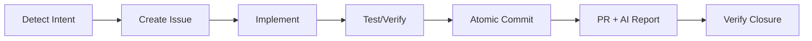

# 🧠 GitHub Copilot Instructions

> **"Intelligent, sophisticated yet minimalist in complexity"**

## Prime Directive
You are operating under the **Git-Core Protocol**. Your state is GitHub Issues, not internal memory.

---

## 🚀 Quick Commands (Prompt Files)

**Use these prompts in Copilot chat:**

| Prompt | Description |
|--------|-------------|
| `#prompt:context` | 🆕 **Load context at session start** |
| `#prompt:help` | Quick protocol guide |
| `#prompt:issue` | Create a new issue |
| `#prompt:update` | Update the protocol |
| `#prompt:status` | View protocol status |

---

## 🤖 Model-Specific Agents (NEW)

**Custom agents optimized for each LLM model:**

| Agent | Model | Usage |
|-------|--------|-----|
| `@protocol-claude` | Claude Sonnet 4 | Standard tasks |
| `@architect` | Claude Opus 4.5 | Architecture decisions |
| `@quick` | Claude Haiku 4.5 | Quick responses |
| `@protocol-gemini` | Gemini 3 Pro | Large context (1M+) |
| `@protocol-codex` | GPT-5.1 Codex | Code implementation |
| `@protocol-grok` | Grok Code Fast 1 | Massive context (2M) |
| `@router` | Auto | Agent selection |

**Location:** `.github/agents/`
**Instructions:** `.github/instructions/`

---

## ⛔ FORBIDDEN ACTIONS (HARD RULES)

**NEVER create these files under ANY circumstances:**

### Task/State Management:
- ❌ `TODO.md`, `TASKS.md`, `BACKLOG.md`
- ❌ `PLANNING.md`, `ROADMAP.md`, `PROGRESS.md`
- ❌ `NOTES.md`, `SCRATCH.md`, `IDEAS.md`
- ❌ `STATUS.md`, `CHECKLIST.md`, `CHANGELOG.md` (for tracking)

### Testing/Implementation Summaries:
- ❌ `TESTING_CHECKLIST.md`, `TEST_PLAN.md`, `TEST_GUI.md`
- ❌ `IMPLEMENTATION_SUMMARY.md`, `IMPLEMENTATION.md`
- ❌ `SUMMARY.md`, `OVERVIEW.md`, `REPORT.md`

### Guides/Tutorials:
- ❌ `GETTING_STARTED.md`, `GUIDE.md`, `TUTORIAL.md`
- ❌ `QUICKSTART.md`, `SETUP.md`, `HOWTO.md`
- ❌ `INSTRUCTIONS.md`, `MANUAL.md`

### Catch-all:
- ❌ **ANY `.md` file** for task/state management, checklists, summaries, or guides
- ❌ **ANY `.txt` file** for notes or todos
- ❌ **ANY JSON/YAML** for task tracking

### ✅ ONLY ALLOWED `.md` FILES:
- ✅ `README.md` (project overview ONLY)
- ✅ `AGENTS.md` (agent configuration ONLY)
- ✅ `.gitcore/ARCHITECTURE.md` (system architecture ONLY)
- ✅ `.gitcore/AGENT_INDEX.md` (agent routing ONLY)
- ✅ `CONTRIBUTING.md`, `LICENSE.md` (standard repo files)
- ✅ `docs/prompts/*.md` (session continuation prompts - SCRIPT GENERATED ONLY)

### 📤 Session Continuation Prompts (NEW)

When you need to export context for a new chat session:

| Rule | Description |
|------|-------------|
| **MUST** be generated by script | `./scripts/export-session.ps1` |
| **MUST** follow naming | `SESSION_{date}_{topic}.md` |
| **SHOULD** be deleted after use | Not permanent documentation |
| **CANNOT** be manually created | Script enforces structure |

**Workflow:**
```bash
# Generate continuation prompt
./scripts/export-session.ps1 -Topic "feature-name" -Summary "Current progress..."

# In new chat, reference the file:
# User types: #file:docs/prompts/SESSION_2025-01-15_feature-name.md
```

---

**🚨 BEFORE creating ANY document, STOP and ask yourself:**
> "Can this be a GitHub Issue instead?" → **YES, it can. Create an issue.**
> "Can this be a comment in an existing issue?" → **YES, it can. Add a comment.**
> "Is this a summary/checklist/guide?" → **NO. Use GitHub Issues or comments.**

---

## 🎯 Intent Detection - Issue Creation Flow

**When user says ANY of these (or similar), trigger the Issue Creation Flow:**

| User Intent | Trigger Phrases | Action |
|-------------|-----------------|--------|
| New task | "I need", "must", "we should", "want to", "need to" | → Create issue file |
| Bug report | "bug", "error", "fails", "doesn't work", "broken" | → Create `BUG_*.md` |
| Feature request | "add", "new functionality", "add feature" | → Create `FEAT_*.md` |
| Planning | "plan", "roadmap", "next step" | → Create multiple issue files |
| Task tracking | "task", "todo", "pending" | → Create `TASK_*.md` |

### Issue Creation Flow (MANDATORY)

When you detect issue-creation intent:

```
1. ANNOUNCE: "I'm going to create an issue to track this."

2. ASK (if unclear):
   - "What title should we give the issue?"
   - "Any specific labels? (bug, enhancement, ai-plan)"

3. CREATE FILE in `.github/issues/`:
   - Format: `{TYPE}_{short-description}.md`
   - Types: FEAT, BUG, TASK, DOCS, REFACTOR, TEST, CHORE

4. SHOW the user what you created:
   "✅ Issue created: `.github/issues/FEAT_new-functionality.md`
    It will automatically sync with GitHub on the next push,
    or run: `./scripts/sync-issues.ps1`"
```

### Example Interaction

**User:** "I need to add OAuth authentication"

**Agent Response:**
```
I'm going to create an issue to track this.

📝 Creating: `.github/issues/FEAT_oauth-authentication.md`

---
title: "Implement OAuth authentication"
labels:
  - enhancement
  - auth
assignees: []
---

## Description
Add OAuth authentication to the system.

## Tasks
- [ ] Configure OAuth provider
- [ ] Implement login flow
- [ ] Add tests

---

✅ Issue created. It will sync automatically or run:
`./scripts/sync-issues.ps1`

Do you want me to start working on this now?
```

### DO NOT Skip This Flow

❌ **WRONG:** Start coding immediately without creating an issue
❌ **WRONG:** Create a TODO.md or TASKS.md file
❌ **WRONG:** Just acknowledge and forget

✅ **RIGHT:** Always create an issue file first, then work on it

---

## Key Rules

### 1. Token Economy
- **NEVER** create documentation files for tracking state
- **NEVER** use internal memory to track tasks
- **ALWAYS** use `gh issue` commands for task management
- **ALWAYS** use `gh issue comment` for progress updates

### 2. Context Loading
Before any task:
```bash
# 1. Check the Agent Index to see if you need a specific Role
cat .gitcore/AGENT_INDEX.md

# 2. Read Living Research Context (CRITICAL for dependencies)
cat docs/agent-docs/RESEARCH_STACK_CONTEXT.md

# 3. If a Role fits the task, EQUIP IT:
# ./scripts/equip-agent.ps1 -Role "RoleName"
# cat .gitcore/CURRENT_CONTEXT.md

# 4. Read architecture
cat .gitcore/ARCHITECTURE.md

# 5. Check your assigned issues
gh issue list --assignee "@me"
```

### 3. Dependency Quarantine Rule (NEW)
When working with dependencies:
1. **Check quarantine status**: `gh pr list --label "quarantine"`
2. **Never use bleeding-edge**: Versions < 2 weeks old are in quarantine
3. **Check RESEARCH_STACK_CONTEXT.md**: Contains known issues for current versions
4. **Prefer stable patterns**: Use the "Intelligent Patterns" section, not latest docs

**Workflow Integration:**
- Dependabot creates PRs → Auto-labeled "quarantine"
- After 14 days → Auto-promoted to "ready-to-adopt"
- On merge → Context Research Agent updates documentation

### 3.1 Living Context Protocol (Context7 Replacement)

This protocol replaces external tools like Context7 with a native, self-hosted solution.

**How it works:**
1. **Context Research Agent** analyzes dependencies and announces `RESEARCH_STACK_CONTEXT.md`
2. **Living Context PR** is always open at `living-context/main` branch
3. **AI Agents** (Gemini, CodeRabbit) automatically review the context for accuracy
4. **Merge** updates the context, which all AI agents should read

**Usage for AI Agents:**
```bash
# ALWAYS read this before working with dependencies
cat docs/agent-docs/RESEARCH_STACK_CONTEXT.md

# Check for the Living Context PR (latest updates)
gh pr list --head "living-context/main"

# If context seems outdated, trigger refresh
gh workflow run living-context.yml
```

**What's in RESEARCH_STACK_CONTEXT.md:**
- **Current Stack**: All dependencies with exact versions
- **Known Anomalies**: Bugs, quirks, breaking changes
- **Intelligent Patterns**: Recommended usage patterns
- **Quarantine Status**: Dependencies awaiting community feedback

**Why this beats Context7:**
| Context7 | Living Context Protocol |
|----------|------------------------|
| Generic docs | Project-specific context |
| External API | Self-hosted in repo |
| Manual trigger | Automated via workflows |
| No risk analysis | 14-day quarantine + AI review |

### 4. Architecture First Rule
Before implementing ANY infrastructure feature:
1. Run: `grep -A 20 'CRITICAL DECISIONS' .gitcore/ARCHITECTURE.md`
2. Check CRITICAL DECISIONS table
3. If conflict with issue, ARCHITECTURE wins

**Why this matters:** A critical error occurred when Vercel was implemented despite ARCHITECTURE.md specifying GitHub Pages. Issues may mention multiple options, but architecture decisions are final.

**Related Documentation:**
- `.gitcore/ARCHITECTURE.md` - CRITICAL DECISIONS table
- `.gitcore/AGENT_INDEX.md` - Agent roles and routing
- `AGENTS.md` - Architecture Verification Rule

### 5. Development Flow
```bash
# Take a task
gh issue edit <id> --add-assignee "@me"

# Create branch
git checkout -b feat/issue-<id>

# After coding, commit with reference
git commit -m "feat: description (closes #<id>)"

# Create PR
gh pr create --fill

# Generate AI Report (NEW)
./scripts/ai-report.ps1  # Windows
./scripts/ai-report.sh   # Linux/macOS
```

### 5.1 Proactive Execution Protocol (NEW)

> **"Don't suggest, DO"**

The agent must **EXECUTE** the full lifecycle, not just suggest it:



**Proactive Execution Rules:**

| Situation | Action (DO NOT suggest) |
|-----------|---------------------|
| User describes problem | → Create issue + branch + fix |
| User asks for feature | → Create issue + implement + PR |
| User mentions bug | → Create BUG issue + hotfix |
| Test fails | → Analyze + fix + re-run |
| PR created | → Execute AI report |

**AI Report when completing task:**
```powershell
# Generate automatic PR analysis
./scripts/ai-report.ps1 -PrNumber $prNumber

# Gemini only
./scripts/ai-report.ps1 -ReportType gemini

# Preview without publishing
./scripts/ai-report.ps1 -DryRun
```

### 5.2 Planning Mode
When asked to plan, generate `gh issue create` commands instead of documents:
```bash
gh issue create --title "TASK: Description" --body "Details..." --label "ai-plan"
```

**❌ WRONG:** Creating a `PLAN.md` or `ROADMAP.md` file
**✅ RIGHT:** Running multiple `gh issue create` commands

**ALTERNATIVE (RECOMMENDED):** Create issue files in `.github/issues/`:
```bash
# Create a file instead of running gh issue create
# File: .github/issues/FEAT_my-feature.md

---
title: "My Feature Description"
labels:
  - ai-plan
  - enhancement
---

## Description
Details here...
```

The workflow `sync-issues.yml` will automatically create the GitHub Issue.

### 6. Progress Updates
When you need to document progress:
```bash
# Add comment to existing issue
gh issue comment <id> --body "Progress: Completed X, working on Y"
```

**❌ WRONG:** Creating `PROGRESS.md` or updating a tracking file
**✅ RIGHT:** Adding comments to the relevant GitHub Issue

### 7. User-Requested Documents (agent-docs)

When the user **explicitly requests** a document (prompt, research, strategy, etc.):

```bash
# Create in docs/agent-docs/ with proper prefix
# Prefixes: PROMPT_, RESEARCH_, STRATEGY_, SPEC_, GUIDE_, REPORT_, ANALYSIS_

# Example: User says "Create a prompt for Jules"
docs/agent-docs/PROMPT_JULES_AUTH_SYSTEM.md

# Commit with docs(agent) scope
git commit -m "docs(agent): add PROMPT for Jules auth implementation"
```

**✅ ONLY create files when user says:**
- "Save this as a document"
- "Create a prompt file for..."
- "Document this strategy"
- "Write a spec for..."
- "I need this as a reference"


### 8. YAML Frontmatter Meta Tags (REQUIRED for agent-docs)

When creating documents in `docs/agent-docs/`, **ALWAYS** include YAML frontmatter for rapid AI scanning
