# 🧠 GitHub Copilot Instructions

> **"⚡ Intelligent, fast and minimalist - Rust-powered, sub-second execution"**

## Prime Directive
You are operating under the **Git-Core Protocol**. Your state is GitHub Issues, not internal memory.

---

## 🚀 Quick Commands (Prompt Files)

**Usa estos prompts en el chat de Copilot:**

| Prompt | Description |
|--------|-------------|
| `#prompt:context` | 🆕 **Load context at session start** |
| `#prompt:help` | Quick protocol guide |
| `#prompt:issue` | Create a new issue |
| `#prompt:update` | Update the protocol |
| `#prompt:status` | View protocol status |

---

## 🤖 Model-Specific Agents (NEW)

**Custom agents optimizados para cada modelo LLM:**

| Agent | Modelo | Uso |
|-------|--------|-----|
| `@protocol-claude` | Claude Sonnet 4 | Tareas estándar |
| `@architect` | Claude Opus 4.5 | Decisiones de arquitectura |
| `@quick` | Claude Haiku 4.5 | Respuestas rápidas |
| `@protocol-gemini` | Gemini 3 Pro | Contexto grande (1M+) |
| `@protocol-codex` | GPT-5.1 Codex | Implementación de código |
| `@protocol-grok` | Grok Code Fast 1 | Contexto masivo (2M) |
| `@router` | Auto | Selección de agente |

**Ubicación:** `.github/agents/`
**Instrucciones:** `.github/instructions/`

---

## ⛔ FORBIDDEN ACTIONS (HARD RULES)

**NEVER create these files under ANY circumstances:**

### Task/State Management:
- ❌ `TODO.md`, `TASKS.md`, `BACKLOG.md`
- ❌ `PLANNING.md`, `ROADMAP.md`, `PROGRESS.md`
- ❌ `NOTES.md`, `SCRATCH.md`, `IDEAS.md`
- ❌ `STATUS.md`, `CHECKLIST.md`, `CHANGELOG.md` (for tracking)

### Testing/Implementation Summaries:
- ❌ `TESTING_CHECKLIST.md`, `TEST_PLAN.md`, `TEST_GUI.md`
- ❌ `IMPLEMENTATION_SUMMARY.md`, `IMPLEMENTATION.md`
- ❌ `SUMMARY.md`, `OVERVIEW.md`, `REPORT.md`

### Guides/Tutorials:
- ❌ `GETTING_STARTED.md`, `GUIDE.md`, `TUTORIAL.md`
- ❌ `QUICKSTART.md`, `SETUP.md`, `HOWTO.md`
- ❌ `INSTRUCTIONS.md`, `MANUAL.md`

### Catch-all:
- ❌ **ANY `.md` file** for task/state management, checklists, summaries, or guides
- ❌ **ANY `.txt` file** for notes or todos
- ❌ **ANY JSON/YAML** for task tracking

### ✅ ONLY ALLOWED `.md` FILES:
- ✅ `README.md` (project overview ONLY)
- ✅ `AGENTS.md` (agent configuration ONLY)
- ✅ `.gitcore/ARCHITECTURE.md` (system architecture ONLY)
- ✅ `.gitcore/AGENT_INDEX.md` (agent routing ONLY)
- ✅ `CONTRIBUTING.md`, `LICENSE.md` (standard repo files)
- ✅ `docs/prompts/*.md` (session continuation prompts - SCRIPT GENERATED ONLY)

### 📤 Session Continuation Prompts (NEW)

When you need to export context for a new chat session:

| Rule | Description |
|------|-------------|
| **MUST** be generated by script | `./scripts/export-session.ps1` |
| **MUST** follow naming | `SESSION_{date}_{topic}.md` |
| **SHOULD** be deleted after use | Not permanent documentation |
| **CANNOT** be manually created | Script enforces structure |

**Workflow:**
```bash
# Generate continuation prompt
./scripts/export-session.ps1 -Topic "feature-name" -Summary "Current progress..."

# In new chat, reference the file:
# User types: #file:docs/prompts/SESSION_2025-01-15_feature-name.md
```

---

**🚨 BEFORE creating ANY document, STOP and ask yourself:**
> "Can this be a GitHub Issue instead?" → **YES, it can. Create an issue.**
> "Can this be a comment in an existing issue?" → **YES, it can. Add a comment.**
> "Is this a summary/checklist/guide?" → **NO. Use GitHub Issues or comments.**

---

## 🎯 Intent Detection - Issue Creation Flow

**When user says ANY of these (or similar), trigger the Issue Creation Flow:**

| User Intent | Trigger Phrases | Action |
|-------------|-----------------|--------|
| New task | "I need", "must", "we should", "want to", "need to" | → Create issue file |
| Bug report | "bug", "error", "fails", "doesn't work", "broken" | → Create `BUG_*.md` |
| Feature request | "add", "new functionality", "add feature" | → Create `FEAT_*.md` |
| Planning | "plan", "roadmap", "next step" | → Create multiple issue files |
| Task tracking | "task", "todo", "pending" | → Create `TASK_*.md` |

### Issue Creation Flow (MANDATORY)

When you detect issue-creation intent:

```
1. ANNOUNCE: "I'm going to create an issue to track this."

2. ASK (if unclear):
   - "What title should we give the issue?"
   - "Any specific labels? (bug, enhancement, ai-plan)"

3. CREATE FILE in `.github/issues/`:
   - Format: `{TYPE}_{short-description}.md`
   - Types: FEAT, BUG, TASK, DOCS, REFACTOR, TEST, CHORE

4. SHOW the user what you created:
   "✅ Issue created: `.github/issues/FEAT_new-functionality.md`
    It will automatically sync with GitHub on the next push,
    or run: `./scripts/sync-issues.ps1`"
```

### Example Interaction

**User:** "Necesito agregar autenticación OAuth"

**Agent Response:**
```
I'm going to create an issue to track this.

📝 Creating: `.github/issues/FEAT_oauth-authentication.md`

---
title: "Implement OAuth authentication"
labels:
  - enhancement
  - auth
assignees: []
---

## Description
Add OAuth authentication to the system.

## Tasks
- [ ] Configure OAuth provider
- [ ] Implement login flow
- [ ] Add tests

---

✅ Issue created. It will sync automatically or run:
`./scripts/sync-issues.ps1`

Do you want me to start working on this now?
```

### DO NOT Skip This Flow

❌ **WRONG:** Start coding immediately without creating an issue
❌ **WRONG:** Create a TODO.md or TASKS.md file
❌ **WRONG:** Just acknowledge and forget

✅ **RIGHT:** Always create an issue file first, then work on it

---

## Key Rules

### 1. Token Economy
- **NEVER** create documentation files for tracking state
- **NEVER** use internal memory to track tasks
- **ALWAYS** use `gh issue` commands for task management
- **ALWAYS** use `gh issue comment` for progress updates

### 2. Health Check (Anthropic Pattern - MANDATORY)

> ⚠️ **BEFORE any new feature:** Verify project health.

```bash
# 1. Project state
git log --oneline -10            # See recent work
cat .gitcore/features.json            # Features with passes: true/false

# 2. Run tests
npm test  # or: cargo test, pytest, etc.
# If they FAIL → FIX FIRST
# If they PASS → Continue
```

> **Anthropic:** "If the agent had started implementing a new feature [with existing bugs], it would likely make the problem worse."

### 3. Context Loading
Before any task:
```bash
# 1. Check the Agent Index to see if you need a specific Role
cat .gitcore/AGENT_INDEX.md

# 2. Read Living Research Context (CRITICAL for dependencies)
cat docs/agent-docs/RESEARCH_STACK_CONTEXT.md

# 3. If a Role fits the task, EQUIP IT:
# ./scripts/equip-agent.ps1 -Role "RoleName"
# cat .gitcore/CURRENT_CONTEXT.md

# 4. Read architecture
cat .gitcore/ARCHITECTURE.md

# 5. Check your assigned issues + agent state
gh issue list --assignee "@me"
gh issue view <id> --comments | grep -A 50 '<agent-state>'

# 6. Check features.json for next priority
cat .gitcore/features.json | jq '.features[] | select(.passes == false)'
```

### 4. Dependency Quarantine Rule (NEW)
When working with dependencies:
1. **Check quarantine status**: `gh pr list --label "quarantine"`
2. **Never use bleeding-edge**: Versions < 7 days old are in quarantine
3. **Check RESEARCH_STACK_CONTEXT.md**: Contains known issues for current versions
4. **Prefer stable patterns**: Use the "Intelligent Patterns" section, not latest docs

**Workflow Integration:**
- Dependabot creates PRs → Auto-labeled "quarantine"
- After 7 days → Auto-promoted to "ready-to-adopt"
- On merge → Context Research Agent updates documentation

### 4.1 Living Context Protocol (Context7 Replacement)

This protocol replaces external tools like Context7 with a native, self-hosted solution.

**How it works:**
1. **Context Research Agent** analyzes dependencies and creates `RESEARCH_STACK_CONTEXT.md`
2. **Living Context PR** is always open at `living-context/main` branch
3. **AI Agents** (Gemini, CodeRabbit) automatically review the context for accuracy
4. **Merge** updates the context, which all AI agents should read

**Usage for AI Agents:**
```bash
# ALWAYS read this before working with dependencies
cat docs/agent-docs/RESEARCH_STACK_CONTEXT.md

# Check for the Living Context PR (latest updates)
gh pr list --head "living-context/main"

# If context seems outdated, trigger refresh
gh workflow run living-context.yml
```

**What's in RESEARCH_STACK_CONTEXT.md:**
- **Current Stack**: All dependencies with exact versions
- **Known Anomalies**: Bugs, quirks, breaking changes
- **Intelligent Patterns**: Recommended usage patterns
- **Quarantine Status**: Dependencies awaiting community feedback

**Why this beats Context7:**
| Context7 | Living Context Protocol |
|----------|------------------------|
| Generic docs | Project-specific context |
| External API | Self-hosted in repo |
| Manual trigger | Automated via workflows |
| No risk analysis | 7-day quarantine + AI review |

### 4. Architecture First Rule
Before implementing ANY infrastructure feature:
1. Run: `grep -A 20 'CRITICAL DECISIONS' .gitcore/ARCHITECTURE.md`
2. Check CRITICAL DECISIONS table
3. If conflict with issue, ARCHITECTURE wins

**Why this matters:** A critical error occurred when Vercel was implemented despite ARCHITECTURE.md specifying GitHub Pages. Issues may mention multiple options, but architecture decisions are final.

**Related Documentation:**
- `.gitcore/ARCHITECTURE.md` - CRITICAL DECISIONS table
- `.gitcore/AGENT_INDEX.md` - Agent roles and routing
- `AGENTS.md` - Architecture Verification Rule

### 5. Development Flow
```bash
# Take a task
gh issue edit <id> --add-assignee "@me"

# Create branch
git checkout -b feat/issue-<id>

# After coding, commit with reference
git commit -m "feat: description (closes #<id>)"

# Create PR
gh pr create --fill

# Generate AI Report (NEW)
./scripts/ai-report.ps1  # Windows
./scripts/ai-report.sh   # Linux/macOS
```

### 5.1 Proactive Execution Protocol (NUEVO)

> **"No sugerir, HACER"**

El agente debe **EJECUTAR** el ciclo de vida completo, no solo sugerirlo:

```mermaid
graph LR
    A[Detectar Intent] --> B[Crear Issue]
    B --> C[Implementar]
    C --> D[Test/Verify]
    D --> E[Commit Atómico]
    E --> F[PR + AI Report]
    F --> G[Verificar Cierre]
```



**Reglas de Ejecución Proactiva:**

| Situación | Acción (NO sugerir) |
|-----------|---------------------|
| Usuario describe problema | → Crear issue + branch + fix |
| Usuario pide feature | → Crear issue + implementar + PR |
| Usuario menciona bug | → Crear BUG issue + hotfix |
| Test falla | → Analizar + fix + re-run |
| PR creado | → Ejecutar AI report |

**AI Report when completing task:**
```powershell
# Generate automatic PR analysis
./scripts/ai-report.ps1 -PrNumber $prNumber

# Gemini only
./scripts/ai-report.ps1 -ReportType gemini

# Preview without publishing
./scripts/ai-report.ps1 -DryRun
```

### 5.2 Planning Mode
When asked to plan, generate `gh issue create` commands instead of documents:
```bash
gh issue create --title "TASK: Description" --body "Details..." --label "ai-plan"
```

**❌ WRONG:** Creating a `PLAN.md` or `ROADMAP.md` file
**✅ RIGHT:** Running multiple `gh issue create` commands

**ALTERNATIVE (RECOMMENDED):** Create issue files in `.github/issues/`:
```bash
# Create a file instead of running gh issue create
# File: .github/issues/FEAT_mi-feature.md

---
title: "My Feature Description"
labels:
  - ai-plan
  - enhancement
---

## Description
Details here...
```

The workflow `sync-issues.yml` will automatically create the GitHub Issue.

### 6. Progress Updates
When you need to document progress:
```bash
# Add comment to existing issue
gh issue comment <id> --body "Progress: Completed X, working on Y"
```

**❌ WRONG:** Creating `PROGRESS.md` or updating a tracking file
**✅ RIGHT:** Adding comments to the relevant GitHub Issue

### 7. User-Requested Documents (agent-docs)

When the user **explicitly requests** a document (prompt, research, strategy, etc.):

```bash
# Create in docs/agent-docs/ with proper prefix
# Prefixes: PROMPT_, RESEARCH_, STRATEGY_, SPEC_, GUIDE_, REPORT_, ANALYSIS_

# Example: User says "Create a prompt for Jules"
docs/agent-docs/PROMPT_JULES_AUTH_SYSTEM.md

# Commit with docs(agent) scope
git commit -m "docs(agent): add PROMPT for Jules auth implementation"
```

**✅ ONLY create files when user says:**
- "Save this as a document"
- "Create a prompt file for..."
- "Document this strategy"
- "Write a spec for..."
- "I need this as a reference"

**❌ DO NOT create files, just respond in chat:**
- "Explain how to..."
- "Summarize this..."
- "What's the best approach..."

### 8. YAML Frontmatter Meta Tags (REQUIRED for agent-docs)

When creating documents in `docs/agent-docs/`, **ALWAYS** include YAML frontmatter for rapid AI scanning:

```yaml
---
title: "Authentication System Prompt"
type: PROMPT
id: "prompt-jules-auth"
created: 2025-11-29
updated: 2025-11-29
agent: copilot
model: claude-opus-4
requested_by: user
summary: |
  Prompt for Jules to implement OAuth2 authentication
  with Google and GitHub providers.
keywords: [oauth, auth, jules, security]
tags: ["#auth", "#security", "#jules"]
topics: [authentication, ai-agents]
related_issues: ["#42"]
project: my-project
module: auth
language: typescript
priority: high
status: approved
confidence: 0.92
token_estimate: 800
complexity: moderate
---
```

**Why?** AI agents can read metadata without parsing entire documents. See `docs/agent-docs/README.md` for full spec.

### 9. Non-Blocking Execution (CRITICAL)

**ALWAYS use background execution for long-running commands to avoid blocking chat:**

| Command Type | When | Pattern |
|--------------|------|---------|
| **Tests** | `npm test`, `pytest`, `cargo test` | Redirect to file, show summary |
| **Builds** | `npm build`, `cargo build` | Background + status only |
| **Git ops** | `git log`, `git diff` (>10 lines) | File + count summary |
| **CI workflows** | Any validation script | Always background |

**✅ RIGHT - Non-blocking:**
```powershell
npm test > test-results.txt 2>&1
$passed = (Select-String "PASSED" test-results.txt).Count
Write-Host "✅ Tests: $passed passed. Details: test-results.txt"
```

**❌ WRONG - Blocks chat:**
```powershell
$output = npm test
Write-Host $output  # Shows 200+ lines, blocks user
```

**Summary format (max 3 lines in chat):**
```
✅ [Task] complete: [metric]
📄 Full output: [filename]
```

See: `docs/agent-docs/PROTOCOL_NON_BLOCKING_EXECUTION.md`

### 10. Extended Commit Messages

Use AI-Context section for complex changes:

```text
feat(auth): implement OAuth2 login #42

Adds OAuth2 authentication with Google and GitHub providers.
Includes refresh token rotation and session management.

AI-Context: Uses passport.js. Config in src/config/auth.ts.
Test credentials in .env.example.

Closes #42
```

### 10. Code Standards
- Follow existing code style
- Write tests for new features
- Use Conventional Commits (see docs/COMMIT_STANDARD.md)
- Keep PRs focused and small

### 11. Communication
- Be concise in commit messages
- Reference issues in all commits
- Use AI-Context for complex changes
- Update issue comments for significant progress

### 12. Codex CLI Integration

**Installation:**
```bash
npm i -g @openai/codex
export OPENAI_API_KEY=your-api-key
```

**Usage modes:**
```bash
codex                      # Interactive mode
codex "explain this code"  # Quick query
codex exec "..."           # Headless automation
```

**Trigger via GitHub:**
- Add label `codex-review` to PR for automated review
- Comment `/codex-review` for on-demand review
- Comment `/codex-analyze` for codebase analysis

### 13. GitHub Copilot Coding Agent

**⚠️ Copilot is GitHub-only - NO CLI available.**

**Assign issues to Copilot:**
```bash
# Method 1: Add label
gh issue edit <number> --add-label "copilot"

# Method 2: Assign directly
gh issue edit <number> --add-assignee "Copilot"
```

**Trigger in PRs:**
- Mention `@copilot` in PR comments for specific tasks
- Copilot creates branches named `copilot/*`

**Monitor Copilot work:**
```bash
gh pr list --head "copilot/"
```

### 14. Google Jules Agent (🔥 RECOMMENDED FOR DELEGATION)

**Jules is the best choice for autonomous task delegation.**

#### How Jules Works

1. **Label-based activation**: Add label `jules` to any issue
2. **Jules auto-responds**: Starts working immediately
3. **Creates PR**: When done, opens a Pull Request
4. **Human reviews**: You approve or request changes

#### Delegating to Jules - Best Practices

**Step 1: Create a DETAILED issue**

Jules needs explicit instructions. Include:

```markdown
## 🎯 Objective
[Exactly what to accomplish]

## 📁 Files to Modify/Create
[List specific file paths with code snippets]

### 1. File: `path/to/file.ts`
```typescript
// EXACT code to add or modify
```

## ✅ Acceptance Criteria
- [ ] Specific testable criteria
- [ ] Compilation must pass
- [ ] Tests must pass

## 🧪 Testing Commands
```bash
npm test
cargo check
```

## ⏱ Estimated Effort
X-Y hours
```

**Step 2: Add the `jules` label**

```bash
# Via CLI
gh issue edit <number> --add-label "jules"

# Or in GitHub UI: Labels → jules
```

**Step 3: Monitor Jules**

```bash
# Check if Jules commented
gh issue view <number> --comments

# Check for PRs from Jules
gh pr list --search "author:googlestaging"
```

**Step 4: Review & Merge**

- Jules creates PR with all changes
- Review the code
- Request changes if needed (Jules will respond)
- Approve and merge

#### Issue Format for Jules (REQUIRED)

For Jules to work effectively, issues MUST have:

| Section | Required | Purpose |
|---------|----------|---------|
| 🎯 Objective | ✅ | What to accomplish |
| 📁 Files to Modify | ✅ | Exact file paths |
| Code Snippets | ✅ | Sample implementation |
| ✅ Acceptance Criteria | ✅ | How to verify success |
| 🧪 Testing | ⭐ | Commands to run |

**❌ DON'T create vague issues like:**
- "Implement VPN feature"
- "Fix the auth bug"
- "Make it work"

**✅ DO create detailed issues like:**
- "[MVP] VPN WireGuard Real Integration" with file paths, code, and tests

#### Jules CLI (Alternative to Labels)

```bash
# Install
npm install -g @google/jules
jules login

# Create session from current repo
jules new "implement feature X"

# Create session for specific repo
jules new --repo owner/repo "write unit tests"

# Parallel sessions (1-5)
jules new --parallel 3 "optimize queries"

# Create session from GitHub issue
gh issue view 42 --json title,body | jq -r '.title + "\n\n" + .body' | jules new
```

**Jules CLI Commands:**
```bash
jules                           # Interactive TUI dashboard
jules new "task"                # Create new session
jules remote list --session     # List all sessions
jules remote list --repo        # List connected repos
jules remote pull --session ID  # Get session results
jules remote pull --session ID --apply  # Pull and apply patch
```

### 15. Agent Load Balancing

**Auto-dispatch to available agents:**
```bash
# Add ai-agent label for automatic distribution
gh issue edit <number> --add-label "ai-agent"

# Or trigger workflow manually
gh workflow run agent-dispatcher.yml
```

### 16. AI Code Review Bots (CodeRabbit + Gemini)

**Automated AI reviews on every PR using two complementary bots:**

| Bot | Free For | Commands |
|-----|----------|----------|
| **CodeRabbit** | OSS (Pro free) | Auto-reviews every PR |
| **Gemini Code Assist** | Everyone (100%) | `/gemini review`, `/gemini summary` |

**Workflow:**
1. Create PR → CodeRabbit auto-reviews
2. Address suggestions → Use `/gemini review` for second opinion
3. Human approves → Merge ✅

**Configuration files:**
- `.coderabbit.yaml` - CodeRabbit rules
- `.gemini/config.yaml` - Gemini style guide

### 17. Atomic Commits (MANDATORY)

**ONE commit = ONE logical change. NEVER mix concerns.**

#### Before doing `git add .`, ask yourself:
1. Are all files from the same module/scope?
2. Is it a single type of change (feat/fix/docs/ci)?
3. Can I describe it in < 72 characters?
4. Would reverting it affect only one functionality?

If any answer is "NO" → **SEPARATE INTO MULTIPLE COMMITS**

#### Correct flow:
```bash
# ❌ NEVER
git add .
git commit -m "feat: big update with everything"

# ✅ ALWAYS
git add src/migrations/
git commit -m "feat(db): add user sessions table"

git add src/api/auth/
git commit -m "feat(auth): implement session endpoint"

git add docs/
git commit -m "docs: add authentication guide"
```

#### Tools:
```bash
# If you already have many staged files
git-atomize --analyze    # See separation suggestions
git-atomize --interactive  # Separate interactively
```

---

## 🛠️ Git-Core CLI (RECOMMENDED)

### Overview

`git-core` es el CLI oficial para gestionar el Git-Core Protocol. **SIEMPRE usa el CLI** como método principal para instalar, actualizar y verificar el protocolo.

### Installation

**🔐 Trust & Transparency:** Before installing, read [docs/CLI_TRUST.md](../docs/CLI_TRUST.md) to understand exactly what the CLI does and verify the source code.

```bash
# 🚀 OPTION 1: Shell Scripts (código visible, puedes leerlo antes)
# Linux/macOS
curl -fsSL https://raw.githubusercontent.com/iberi22/Git-Core-Protocol/main/install.sh | bash

# Windows (PowerShell)
irm https://raw.githubusercontent.com/iberi22/Git-Core-Protocol/main/install.ps1 | iex

# 🦀 OPTION 2: Cargo (compila desde código fuente en TU máquina)
# Antes de instalar, lee: docs/CLI_TRUST.md
# Código fuente: https://github.com/iberi22/Git-Core-Protocol/tree/main/tools/git-core-cli
cargo install git-core-cli

# 🔨 OPTION 3: Build from source (máxima confianza)
git clone https://github.com/iberi22/Git-Core-Protocol
cd Git-Core-Protocol/tools/git-core-cli
cargo build --release
./target/release/git-core install
```

### Commands Reference

| Command | Description | When to Use |
|---------|-------------|-------------|
| `gc init` | Initialize project (smart detect) | Start/Setup |
| `gc check` | Validate env & dependencies | Health Check |
| `gc issue list` | List tasks | Planning |
| `gh issue create`| Create issue on GitHub | Task Creation |
| `gemini analyze`| Analyze context/files | Large Context |
| `gh copilot suggest`| Get code suggestions | Implementation |
| `jules run` | Delegate autonomous task | Delegation |

> **📘 Full Guide:** See [docs/agent-docs/CLI_GUIDE.md](../docs/agent-docs/CLI_GUIDE.md) for detailed usage of all ecosystem tools (`gc`, `gh`, `gemini`, `copilot`, `jules`).

### 🚀 Simplified AI Agent Workflow (Sofisticación Invisible)

**Agents MUST use the CLI tools directly:**

1. **Start a Task:**
   ```bash
   gc context equip <role>
   # e.g., gc context equip security
   ```

2. **Validate Work:**
   ```bash
   gc validate
   ```

3. **Report & Finish:**
   ```bash
   gc report
   ```

**Legacy Script Mapping (DEPRECATED):**
| Old Script | New Command |
|------------|-------------|
| `./scripts/init_project.ps1` | `gc init` |
| `./scripts/equip-agent.ps1` | `gc context equip` |
| `./scripts/ai-report.ps1` | `gc report` |
| `./scripts/send-telemetry.ps1`| `gc telemetry` |
| `./scripts/next-task.ps1` | `gc next` |
| `./scripts/sync-issues.ps1` | `gc issue sync` |
| `./scripts/install-cli.ps1` | `gc update` |

### AI Agent Usage

**When bootstrapping a new project:**
```bash
# Step 1: Install protocol
curl -fsSL https://raw.githubusercontent.com/iberi22/Git-Core-Protocol/main/install.sh | bash

# Or if CLI is available:
gc init my-project

# Step 2: Verify installation
gc check
```

**When upgrading existing project:**
```bash
# Safe upgrade
gc update

# Check what changed
gc info
```

**When troubleshooting:**
```bash
# Check integrity
gc check

# Full status report
gc info
```

### Legacy Scripts (Alternative)

Los scripts shell son **código visible** que puedes leer antes de ejecutar:

```bash
# Ver el código ANTES de ejecutar:
curl -fsSL https://raw.githubusercontent.com/iberi22/Git-Core-Protocol/main/install.sh

# Si confías, entonces ejecuta:
curl -fsSL https://raw.githubusercontent.com/iberi22/Git-Core-Protocol/main/install.sh | bash

# Windows - ver código primero:
Invoke-WebRequest -Uri "https://raw.githubusercontent.com/iberi22/Git-Core-Protocol/main/install.ps1" | Select-Object -ExpandProperty Content

# Luego ejecutar:
irm https://raw.githubusercontent.com/iberi22/Git-Core-Protocol/main/install.ps1 | iex
```

**Comparación de métodos:**
| Método | Confianza | Velocidad | Funcionalidades |
|--------|-----------|-----------|-----------------|
| Shell Scripts | ⭐⭐⭐⭐⭐ (código visible) | Rápido | Básico |
| Cargo install | ⭐⭐⭐⭐ (compila local) | Medio | Completo |
| Build from source | ⭐⭐⭐⭐⭐ (máximo control) | Lento | Completo |
| Pre-built binary | ⭐⭐⭐ (verificar checksum) | Muy rápido | Completo |


