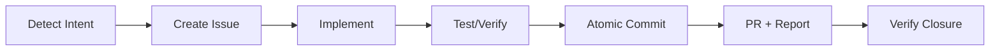

# 🧠 Auto-Context Protocol

> **"Intelligent, sophisticated yet minimalist in complexity"**

## Context Economy Principle

At the beginning of each conversation, detect the user's intent:

| Intent | Context to Load |
|-----------|-------------------|
| "continue", "follow up", "what was I doing" | Git status + assigned issues |
| "new feature", "implement" | ARCHITECTURE.md + open issues |
| "bug", "error", "fix" | Relevant code + problems |
| Simple question | None - respond directly |

## Automatic Loading (Without Asking)

When you detect work intent, execute silently:

```bash
gc git status
gc git log --limit 3
gc issue list --limit 5
```

## Response Format (max 3 context lines)

```
📊 main | 2 modified | 0 ahead
📋 #33 ModelProvider, #35 ResearchAgent
🎯 Continue: #33 (oldest)
```

Then respond to the user's request.

## Golden Rules

1. **Don't ask** - Load context and act
2. **Don't repeat** - If context is already in the conversation, don't reload it
3. **Don't overload** - Only what's necessary for the task
4. **Be concise** - 3-line maximum summary

## Anti-Patterns

- ❌ "Let me check the status..." (just do it)
- ❌ Reading files you don't need
- ❌ Showing full command output
- ❌ "Do you want me to...?" (do it directly)
- ❌ Suggesting without executing
- ✅ Summarize and act

---

## 🚀 Proactive Execution Protocol

> **"Don't suggest, DO"**

### Fundamental Principle

The agent must **EXECUTE** the full lifecycle, not just suggest it.

### Automatic Lifecycle

When you detect a requirement (feature, bug, task):



### Execution Flow (WITHOUT ASKING)

```bash
# 1. DETECT - Analyze the requirement
# User: "There's a bug in login"

# 2. CREATE ISSUE - Immediately
# Creates .github/issues/BUG_login-error.md

# 3. IMPLEMENT - Code + Tests
# git checkout -b fix/issue-<N>
# ... edit files ...

# 4. VERIFY - Run tests
# npm test / cargo test / pytest

# 5. ATOMIC COMMIT
# git add <related files>
# git commit -m "fix(auth): resolve login bug #<N>"

# 6. PR + REPORT
# gh pr create --fill
# gemini "Analyze this PR..." | gh pr comment -F -
# gh copilot explain "..." >> ai-report.md

# 7. VERIFY CLOSURE
# gh issue view <N> --json state
```

### Proactive Execution Rules

| Situation | Action (DO NOT suggest) |
|-----------|---------------------|
| User describes problem | → Create issue + branch + fix |
| User asks for feature | → Create issue + implement + PR |
| User mentions bug | → Create BUG issue + hotfix |
| Test fails | → Analyze + fix + re-run |
| PR created | → Execute AI report |

### Completeness Verification

Before considering a task "complete":

```bash
# Automatic checklist (execute, do not show)
[ ] Issue exists on GitHub (gh issue view <N>)
[ ] Feature/fix branch created
[ ] Code implemented
[ ] Tests pass (execute and verify)
[ ] Commit with issue reference
[ ] PR created
[ ] AI Report added to PR
[ ] Issue closes automatically (closes #N)
```

### AI Report at End of Task

Upon completing a PR, execute automatically:

```bash
# Generate report with Gemini CLI
DIFF=$(gh pr diff)
gemini -p "Analyze this diff and generate a concise technical report:
- Main changes
- System impact
- Potential risks
$DIFF" -o text > /tmp/ai-report.md

# Add as comment to PR
gh pr comment --body-file /tmp/ai-report.md

# Alternative: GitHub Copilot for explanation
gh copilot explain "$(gh pr diff)" >> /tmp/copilot-analysis.txt
```

### Session Closure Commands

At the end of a work session:

```powershell
# PowerShell - Final session report
$changes = git diff --stat HEAD~3
$prs = gh pr list --author "@me" --state open
gemini -p "Summarize this work session:`n$changes`nOpen PRs:`n$prs"
```
