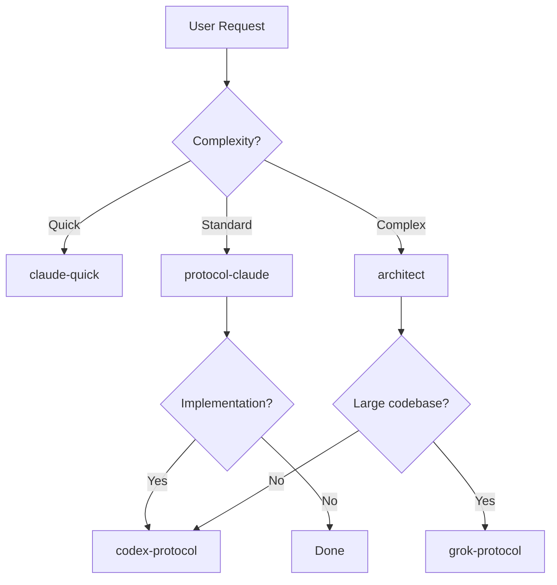

## 📋 Overview

Create specialized custom agents (`.agent.md` files) optimized for each supported LLM model in VS Code Copilot. Each agent will be tailored to leverage the unique strengths and tool-calling patterns of its target model.

## 🎯 Goal

Enable Git-Core Protocol users to automatically get optimized AI assistance based on the model they're using, with model-specific:
- System prompts and instructions
- Tool configurations
- Handoffs between specialized agents
- Best practices for each provider

## 🤖 Target Models

| Model | Provider | Key Strength | Agent Name |
|-------|----------|--------------|------------|
| Claude Sonnet 4.5 | Anthropic | Complex reasoning | `claude-protocol` |
| Claude Opus 4.5 | Anthropic | Deep analysis | `claude-architect` |
| Claude Haiku 4.5 | Anthropic | Fast responses | `claude-quick` |
| Gemini 3 Pro | Google | Multi-modal, 1M context | `gemini-protocol` |
| GPT-5.1 Codex | OpenAI | Agentic coding | `codex-protocol` |
| Grok Code Fast 1 | xAI | 2M context, fast tools | `grok-protocol` |

## 📊 Research Findings

### Tool Calling Comparison

| Feature | Claude 4.5 | Gemini 3 Pro | GPT-5.1 Codex | Grok 4.1 Fast |
|---------|------------|--------------|---------------|---------------|
| **Context Window** | 200K (1M beta) | 1M+ | Undisclosed | **2M** |
| **Tool Format** | `input_schema` | `parameters` | OpenAI style | OpenAI style |
| **MCP Support** | ✅ Native | ✅ Native | ✅ Native | ✅ Remote |
| **Parallel Tools** | ✅ Yes | ✅ Yes | ✅ Yes | ✅ Yes |

### Recommended Usage

| Scenario | Best Model | Why |
|----------|-----------|-----|
| Complex multi-step planning | Claude Opus 4.5 | Superior reasoning |
| Quick issue triage | Claude Haiku 4.5 | Cost-effective, fast |
| Large codebase analysis | Grok 4.1 Fast | 2M context window |
| Code implementation | GPT-5.1 Codex | Purpose-built for code |
| Multi-modal tasks | Gemini 3 Pro | Images, audio, video |

## 📁 Files to Create

### Custom Agents (`.github/agents/`)
- [ ] `protocol-claude.agent.md` - Claude-optimized protocol agent
- [ ] `protocol-gemini.agent.md` - Gemini-optimized protocol agent
- [ ] `protocol-codex.agent.md` - GPT Codex-optimized agent
- [ ] `protocol-grok.agent.md` - Grok-optimized agent
- [ ] `architect.agent.md` - Architecture planning (Claude Opus)
- [ ] `quick.agent.md` - Fast responses (Claude Haiku)

### Instruction Files (`.github/instructions/`)
- [ ] `claude-tools.instructions.md` - Claude tool calling patterns
- [ ] `gemini-tools.instructions.md` - Gemini tool calling patterns
- [ ] `codex-tools.instructions.md` - GPT Codex tool calling patterns
- [ ] `grok-tools.instructions.md` - Grok tool calling patterns

## 🔄 Agent Handoffs

## ✅ Acceptance Criteria

- [ ] Each agent has model-specific system prompt
- [ ] Tool configurations match model capabilities
- [ ] Handoffs enable workflow transitions
- [ ] Instructions files provide model-specific guidance
- [ ] Documentation updated in AGENTS.md
- [ ] Version bump to 1.4.0

## 📚 References

- [VS Code Custom Agents](https://code.visualstudio.com/docs/copilot/customization/custom-agents)
- [VS Code Prompt Files](https://code.visualstudio.com/docs/copilot/customization/prompt-files)
- [Anthropic Tool Use](https://docs.anthropic.com/en/docs/build-with-claude/tool-use)
- [OpenAI Function Calling](https://platform.openai.com/docs/guides/function-calling)
- [Gemini Function Calling](https://ai.google.dev/gemini-api/docs/function-calling)

