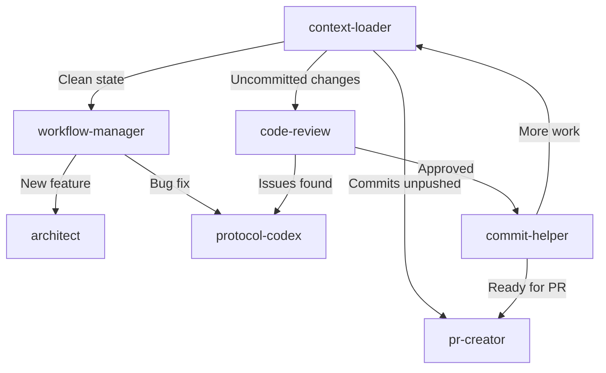

## 📋 Overview

Create a smart workflow control panel using custom agents and handoffs that replaces manual workflows. The system automatically discovers project state and guides the user through appropriate actions.

## 🎯 Goal

Enable AI agents to:
1. **Discover context automatically** (git status, PRs, issues, dependencies)
2. **Suggest next actions** based on current state
3. **Orchestrate multi-step workflows** with handoffs
4. **Integrate with MCP servers** for rich GitHub context

## 🤖 New Workflow Agents

| Agent | Purpose | Model |
|-------|---------|-------|
| `context-loader` | Auto-discover project state | Claude Sonnet 4 |
| `workflow-manager` | Orchestrate dev workflows | Claude Sonnet 4 |
| `code-review` | Review changes before commit | Claude Opus 4.5 |
| `commit-helper` | Create atomic commits | Claude Haiku 4.5 |
| `pr-creator` | Create well-formatted PRs | Claude Sonnet 4 |

## 🔄 Workflow Flow

## ✅ Implementation Tasks

- [x] Create `context-loader.agent.md`
- [x] Create `workflow-manager.agent.md`
- [x] Create `code-review.agent.md`
- [x] Create `commit-helper.agent.md`
- [x] Create `pr-creator.agent.md`
- [x] Update existing agents with model-specific behaviors
- [ ] Document in AGENTS.md
- [ ] Test workflow end-to-end
