# Architecture Analysis Request

**Context:** I need you to act as a Senior Software Architect and review the following project.
Your goal is to understand the project structure, current architecture, and goals, and then provide a robust architecture assessment.

## Project Structure
`	ext
.agent/
.ai-core/
.github/
.vscode/
bin/
docs/
scripts/
telemetry/
templates/
tests/
tools/
.coderabbit.yaml
.cursorrules
.git-atomize.yml.example
.git-core-protocol-version
.gitignore
.propagation.json
.windsurfrules
AGENTS.md
CHANGELOG.md
CLAUDE.md
infographic.png
install.ps1
install.sh
LICENSE
logo.png
README.md
VERSION
.agent\rules/
.agent\workflows/
.agent\rules\rule-0.md
.agent\workflows\reolplazr.md
.ai-core\AGENT_INDEX.md
.ai-core\ARCHITECTURE.md
.ai-core\CLI_CONFIG.md
.ai-core\CONTEXT_LOG.md
.ai-core\features.json
.github\actions/
.github\agents/
.github\instructions/
.github\ISSUE_TEMPLATE/
.github\issues/
.github\prompts/
.github\workflows/
.github\atomicity-config.yml
.github\copilot-instructions.md
.github\copilot-setup-steps.yml
.github\dependabot.yml
.github\actions\structure-validator/
.github\actions\structure-validator\src/
.github\actions\structure-validator\Cargo.toml
.github\actions\structure-validator\src\main.rs
.github\agents\.github/
.github\agents\architect.agent.md
.github\agents\code-review.agent.md
.github\agents\commit-helper.agent.md
.github\agents\context-loader.agent.md
.github\agents\pr-creator.agent.md
.github\agents\protocol-claude.agent.md
.github\agents\protocol-codex.agent.md
.github\agents\protocol-gemini.agent.md
.github\agents\protocol-grok.agent.md
.github\agents\quick.agent.md
.github\agents\recipe-loader.agent.md
.github\agents\router.agent.md
.github\agents\session-exporter.agent.md
.github\agents\workflow-manager.agent.md
.github\agents\workspace-hub.agent.md
.github\agents\.github\issues/
.github\agents\.github\issues\.issue-mapping.json
.github\instructions\auto-context.instructions.md
.github\instructions\claude-tools.instructions.md
.github\instructions\codex-tools.instructions.md
.github\instructions\fallback-system.instructions.md
.github\instructions\gemini-tools.instructions.md
.github\instructions\grok-tools.instructions.md
.github\issues\_TEMPLATE.md
.github\issues\.gitkeep
.github\issues\.issue-mapping.json
.github\issues\BUG_install_unicode_encoding.md
.github\issues\FEAT_cli_integration_hub.md
.github\issues\FEAT_gc-issue-command.md
.github\issues\FEAT_protocol-v3-full-autonomy.md
.github\issues\FEAT_robust_init_dependencies.md
.github\issues\FEAT_rust-dispatcher-agent.md
.github\issues\FEAT_rust-guardian-agent.md
.github\issues\FEAT_rust-issue-syncer.md
.github\issues\FEAT_test_sync.md
.github\issues\PLAN_CLI_Roadmap.md
.github\issues\sync-test.md
.github\issues\TASK_ci-failure-cargo-in-update-1186649950.md
.github\issues\TASK_organize-agent-docs.md
.github\issues\TEST_e2e_testing_framework.md
.github\ISSUE_TEMPLATE\bug.md
.github\ISSUE_TEMPLATE\feature.md
.github\ISSUE_TEMPLATE\task.md
.github\prompts\context.prompt.md
.github\prompts\export.prompt.md
.github\prompts\help.prompt.md
.github\prompts\issue.prompt.md
.github\prompts\status.prompt.md
.github\prompts\update.prompt.md
.github\workflows\_repo-config.yml
.github\workflows\aggregate-telemetry.yml
.github\workflows\auto-assign.yml
.github\workflows\build-tools.yml
.github\workflows\ci-health.yml
.github\workflows\commit-atomicity.yml
.github\workflows\copilot-auto-implementation.yml
.github\workflows\copilot-meta-analysis.yml
.github\workflows\dependency-manager.yml
.github\workflows\e2e-testing.yml
.github\workflows\evolution-cycle.yml
.github\workflows\guardian-agent.yml
.github\workflows\living-context.yml
.github\workflows\planner-agent.yml
.github\workflows\protocol-propagation.yml
.github\workflows\release.yml
.github\workflows\setup-labels.yml
.github\workflows\structure-validator.yml
.github\workflows\sync-issues.yml
.github\workflows\update-protocol.yml
.github\workflows\user-notifications.yml
.github\workflows\workflow-validator.yml
.vscode\settings.json
bin\.gitkeep
bin\atomicity-checker-linux
bin\atomicity-checker.exe
bin\context-research-agent-linux
bin\context-research-agent.exe
bin\workflow-orchestrator-linux
docs\agent-docs/
docs\explanation/
docs\how-to/
docs\prompts/
docs\reference/
docs\setup/
docs\templates/
docs\tutorials/
docs\wiki/
docs\DOCUMENTATION_SYSTEM.md
docs\infographic.html
docs\README.md
docs\RFC_001_RUST_UNIFICATION.md
docs\agent-docs\analysis/
docs\agent-docs\archive/
docs\agent-docs\prompts/
docs\agent-docs\reports/
docs\agent-docs\research/
docs\agent-docs\sessions/
docs\agent-docs\specs/
docs\agent-docs\.gitkeep
docs\agent-docs\CLI_GUIDE.md
docs\agent-docs\README.md
docs\agent-docs\RESEARCH_STACK_CONTEXT.md
docs\agent-docs\analysis\.gitkeep
docs\agent-docs\analysis\ANALYSIS_TELEMETRY_SCALE.md
docs\agent-docs\analysis\ANALYSIS_WORKFLOW_RUST_MIGRATION.md
docs\agent-docs\analysis\README.md
docs\agent-docs\archive\.gitkeep
docs\agent-docs\prompts\.gitkeep
docs\agent-docs\prompts\PROMPT_IMPROVE_RECIPES.md
docs\agent-docs\prompts\PROMPT_PROTOCOL_INSTALLER.md
docs\agent-docs\prompts\README.md
docs\agent-docs\reports\.gitkeep
docs\agent-docs\reports\README.md
docs\agent-docs\reports\REPORT_GLOBAL_SELFHEALING_DIAGNOSIS.md
docs\agent-docs\reports\REPORT_PROJECT_AUDIT.md
docs\agent-docs\reports\REPORT_WORKFLOW_OPTIMIZATION.md
docs\agent-docs\research\.gitkeep
docs\agent-docs\research\README.md
docs\agent-docs\research\RESEARCH_LLM_TOOL_CALLING.md
docs\agent-docs\research\RESEARCH_SELFHEALING_CICD.md
docs\agent-docs\research\RESEARCH_STACK_CONTEXT.md
docs\agent-docs\sessions\2025-12/
docs\agent-docs\sessions\.gitkeep
docs\agent-docs\sessions\2025-12\SESSION_2025-12-06_protocol-v3-2-session-analytics.md
docs\agent-docs\sessions\2025-12\SESSION_2025-12-07_full-protocol-alignment.md
docs\agent-docs\specs\.gitkeep
docs\agent-docs\specs\ADAPTIVE_WORKFLOWS.md
docs\agent-docs\specs\PROTOCOL_PROPAGATION.md
docs\agent-docs\specs\README.md
docs\agent-docs\specs\SPEC_CONTEXT_PROTOCOL.md
docs\agent-docs\specs\SPEC_DRAFT_PR_MERGE.md
docs\agent-docs\specs\SPEC_EVOLUTION_PROTOCOL.md
docs\agent-docs\specs\SPEC_HUMAN_LAYER_PROTOCOL.md
docs\agent-docs\specs\SPEC_MICRO_AGENTS.md
docs\agent-docs\specs\SPEC_NON_BLOCKING_EXECUTION.md
docs\explanation\CLI_TRUST.md
docs\explanation\DOCUMENTATION_MIGRATION.md
docs\explanation\README.md
docs\how-to\README.md
docs\how-to\SESSION_EXPORT.md
docs\prompts\README.md
docs\reference\COMMIT_STANDARD.md
docs\reference\README.md
docs\setup\AUTOMATION_SETUP.md
docs\templates\plan.md
docs\templates\spec.md
docs\templates\tasks.md
docs\tutorials\ATOMIC_COMMITS.md
docs\tutorials\README.md
docs\wiki\Home.md
scripts\hooks/
scripts\agent-state.ps1
scripts\agent-state.sh
scripts\ai-report.ps1
scripts\ai-report.sh
scripts\analyze-architecture.ps1
scripts\analyze-atomicity.sh
scripts\archive-sessions.ps1
scripts\bump-version.ps1
scripts\bump-version.sh
scripts\check-protocol-update.ps1
scripts\check-protocol-update.sh
scripts\deploy-self-healing.ps1
scripts\detect-repo-config.ps1
scripts\detect-repo-config.sh
scripts\dispatcher-core.ps1
scripts\equip-agent.ps1
scripts\equip-agent.sh
scripts\evolution-metrics.ps1
scripts\export-session.ps1
scripts\generate-session-metrics.ps1
scripts\generate-workspace-agent.ps1
scripts\git-atomize.ps1
scripts\git-atomize.sh
scripts\guardian-core.ps1
scripts\init_project.ps1
scripts\init_project.sh
scripts\install-cli.ps1
scripts\install-cli.sh
scripts\merge-draft-pr.ps1
scripts\merge-draft-pr.sh
scripts\migrate-docs-to-diataxis.ps1
scripts\migrate-ide-rules.ps1
scripts\next-task.ps1
scripts\release-protocol.ps1
scripts\send-telemetry.ps1
scripts\sync-issues.ps1
scripts\sync-issues.sh
scripts\test-adaptive-system.ps1
scripts\test-adaptive-system.sh
scripts\test-integration.ps1
scripts\hooks\install-hooks.sh
scripts\hooks\pre-commit
telemetry\README.md
templates\features.json.template
tools\atomicity-checker/
tools\context-research-agent/
tools\git-core/
tools\issue-syncer/
tools\atomicity-checker\src/
tools\atomicity-checker\Cargo.lock
tools\atomicity-checker\Cargo.toml
tools\atomicity-checker\README.md
tools\atomicity-checker\src\analyzer.rs
tools\atomicity-checker\src\config.rs
tools\atomicity-checker\src\git.rs
tools\atomicity-checker\src\main.rs
tools\atomicity-checker\src\reporter.rs
tools\context-research-agent\src/
tools\context-research-agent\Cargo.lock
tools\context-research-agent\Cargo.toml
tools\context-research-agent\src\context.rs
tools\context-research-agent\src\intelligence.rs
tools\context-research-agent\src\main.rs
tools\context-research-agent\src\registry.rs
tools\context-research-agent\src\report.rs
tools\context-research-agent\src\search.rs
tools\git-core\.github/
tools\git-core\crates/
tools\git-core\test-debug/
tools\git-core\test-project-2/
tools\git-core\Cargo.lock
tools\git-core\Cargo.toml
tools\git-core\check_output_2.txt
tools\git-core\check_output_3.txt
tools\git-core\check_output.txt
tools\git-core\test_err.txt
tools\git-core\test_output_init.txt
tools\git-core\test_output.txt
tools\git-core\.github\issues/
tools\git-core\.github\issues\TASK_ci-failure-cargo-in-update-1186649950.md
tools\git-core\crates\gc-adapter-cli/
tools\git-core\crates\gc-adapter-fs/
tools\git-core\crates\gc-adapter-github/
tools\git-core\crates\gc-adapter-system/
tools\git-core\crates\gc-cli/
tools\git-core\crates\gc-core/
tools\git-core\crates\gc-validator/
tools\git-core\crates\gc-adapter-cli\src/
tools\git-core\crates\gc-adapter-cli\Cargo.toml
tools\git-core\crates\gc-adapter-cli\src\lib.rs
tools\git-core\crates\gc-adapter-fs\src/
tools\git-core\crates\gc-adapter-fs\Cargo.toml
tools\git-core\crates\gc-adapter-fs\src\lib.rs
tools\git-core\crates\gc-adapter-github\src/
tools\git-core\crates\gc-adapter-github\Cargo.toml
tools\git-core\crates\gc-adapter-github\src\lib.rs
tools\git-core\crates\gc-adapter-system\src/
tools\git-core\crates\gc-adapter-system\Cargo.toml
tools\git-core\crates\gc-adapter-system\src\lib.rs
tools\git-core\crates\gc-cli\src/
tools\git-core\crates\gc-cli\tests/
tools\git-core\crates\gc-cli\Cargo.toml
tools\git-core\crates\gc-cli\src\commands/
tools\git-core\crates\gc-cli\src\main.rs
tools\git-core\crates\gc-cli\src\commands\check.rs
tools\git-core\crates\gc-cli\src\commands\ci_detect.rs
tools\git-core\crates\gc-cli\src\commands\context.rs
tools\git-core\crates\gc-cli\src\commands\dispatch.rs
tools\git-core\crates\gc-cli\src\commands\finish.rs
tools\git-core\crates\gc-cli\src\commands\git.rs
tools\git-core\crates\gc-cli\src\commands\info.rs
tools\git-core\crates\gc-cli\src\commands\init.rs
tools\git-core\crates\gc-cli\src\commands\issue.rs
tools\git-core\crates\gc-cli\src\commands\mocks.rs
tools\git-core\crates\gc-cli\src\commands\mod.rs
tools\git-core\crates\gc-cli\src\commands\next.rs
tools\git-core\crates\gc-cli\src\commands\pr.rs
tools\git-core\crates\gc-cli\src\commands\report.rs
tools\git-core\crates\gc-cli\src\commands\task.rs
tools\git-core\crates\gc-cli\src\commands\telemetry.rs
tools\git-core\crates\gc-cli\src\commands\update.rs
tools\git-core\crates\gc-cli\src\commands\validate.rs
tools\git-core\crates\gc-cli\src\commands\workflow.rs
tools\git-core\crates\gc-cli\tests\cli_tests.rs
tools\git-core\crates\gc-core\src/
tools\git-core\crates\gc-core\Cargo.toml
tools\git-core\crates\gc-core\src\lib.rs
tools\git-core\crates\gc-core\src\ports.rs
tools\git-core\crates\gc-validator\benches/
tools\git-core\crates\gc-validator\src/
tools\git-core\crates\gc-validator\tests/
tools\git-core\crates\gc-validator\Cargo.lock
tools\git-core\crates\gc-validator\Cargo.toml
tools\git-core\crates\gc-validator\README.md
tools\git-core\crates\gc-validator\benches\dispatcher_benchmarks.rs
tools\git-core\crates\gc-validator\benches\guardian_benchmarks.rs
tools\git-core\crates\gc-validator\src\analyzer.rs
tools\git-core\crates\gc-validator\src\dispatcher_core.rs
tools\git-core\crates\gc-validator\src\github.rs
tools\git-core\crates\gc-validator\src\guardian_core.rs
tools\git-core\crates\gc-validator\src\lib.rs
tools\git-core\crates\gc-validator\src\main.rs
tools\git-core\crates\gc-validator\src\parallel.rs
tools\git-core\crates\gc-validator\src\reporter.rs
tools\git-core\crates\gc-validator\src\validator.rs
tools\git-core\crates\gc-validator\tests\integration_dispatcher.rs
tools\git-core\crates\gc-validator\tests\integration_guardian.rs
tools\git-core\test-debug\.github/
tools\git-core\test-debug\.github\issues/
tools\git-core\test-debug\.github\issues\FEAT_test.md
tools\git-core\test-project-2\.ai-core/
tools\git-core\test-project-2\.github/
tools\git-core\test-project-2\docs/
tools\git-core\test-project-2\scripts/
tools\git-core\test-project-2\src/
tools\git-core\test-project-2\tests/
tools\git-core\test-project-2\.git-core-protocol-version
tools\git-core\test-project-2\README.md
tools\git-core\test-project-2\.ai-core\AGENT_INDEX.md
tools\git-core\test-project-2\.ai-core\ARCHITECTURE.md
tools\git-core\test-project-2\.github\copilot-instructions.md
tools\git-core\test-project-2\docs\archive/
tools\issue-syncer\benches/
tools\issue-syncer\src/
tools\issue-syncer\tests/
tools\issue-syncer\bench-results.txt
tools\issue-syncer\Cargo.lock
tools\issue-syncer\Cargo.toml
tools\issue-syncer\issue-syncer-errors.txt
tools\issue-syncer\README.md
tools\issue-syncer\benches\syncer_benchmarks.rs
tools\issue-syncer\src\github.rs
tools\issue-syncer\src\lib.rs
tools\issue-syncer\src\main.rs
tools\issue-syncer\src\mapping.rs
tools\issue-syncer\src\parser.rs
tools\issue-syncer\src\syncer.rs
tools\issue-syncer\tests\integration_syncer.rs

`

## Key Documentation


### File: README.md
`
---
title: "Git-Core Protocol - README"
type: DOCUMENTATION
id: "doc-readme"
created: 2025-12-01
updated: 2025-12-13
agent: copilot
model: claude-sonnet-4
requested_by: system
summary: |
  Project overview, quick start guide, and core principles of the Git-Core Protocol.
  Optimized with Rust-powered agents and simplified architecture.
keywords: [git-core, protocol, ai-agent, template, llm, copilot, claude, gemini, grok, rust]
tags: ["#documentation", "#readme", "#core", "#v3.3.0"]
project: Git-Core-Protocol
version: 3.3.0
---

# 🧠 Git-Core Protocol

[](https://github.com/iberi22/Git-Core-Protocol/generate)
[](https://github.com/iberi22/Git-Core-Protocol/releases/tag/v3.3.0)
[](https://creativecommons.org/licenses/by-nc-sa/4.0/)
[](https://github.com/marketplace/coderabbit)

<div align="center" style="display: flex; align-items: center; justify-content: center; gap: 20px; flex-wrap: wrap;">


<div style="flex: 1; min-width: 500px;">

### ⚡ Performance-First AI Development

**Git-Core Protocol** is a living standard for AI-assisted development, now powered by **Rust-native agents** for 10-30x speedup. It provides a structured workflow where **Human ↔ AI Agent ↔ GitHub** communicate seamlessly.

- **How it helps:** Eliminates context loss, enforces architectural consistency, and automates documentation at blazing speed.
- **Workflow:** Issues are state, Commits are atomic, PRs are auto-analyzed, and agents work in sub-second time.
- **Status:** Production-ready with self-healing CI/CD and zero-overhead state management.

| Git-Core Protocol | Compliance | Detail                                      |
|-------------------|------------|---------------------------------------------|
| Defined rules     | ✅          | AGENTS.md, copilot-instructions.md           |
| Syntax            | ✅          | Issue format, conventional commits           |
| Semantics         | ✅          | Labels, states, workflows                    |
| Synchronization   | ✅          | GitHub Issues as state, workflows            |

</div>

</div>

---

## 🌍 Language | Idioma | Língua | Sprache | Langue | 言語 | 语言

<div align="center">

| Flag | Language | Link |
|:----:|----------|------|
| 🇺🇸 | **English** | [Jump to English](#-english) |
| 🇪🇸 | **Español** | [Ir a Español](#-español) |
| 🇧🇷 | **Português** | [Ir para Português](#-português) |
| 🇩🇪 | **Deutsch** | [Zu Deutsch](#-deutsch) |
| 🇫🇷 | **Français** | [Aller au Français](#-français) |
| 🇯🇵 | **日本語** | [日本語へ](#-日本語) |
| 🇨🇳 | **中文** | [跳转到中文](#-中文) |

</div>

---

# 🇺🇸 English

## 🚀 Quick Start - Just Copy This Prompt

> **Copy this prompt to your AI coding agent (Copilot, Cursor, Claude, etc.) to auto-setup:**

Initialize this project with Git-Core Protocol.

# Method 1: Rust CLI (Recommended)

 cargo install --path . # If local

# OR

 gc init

# Method 2: Shell Scripts (Legacy - Use only if CLI fails)

# Linux/macOS

curl -fsSL <https://raw.githubusercontent.com/iberi22/Git-Core-Protocol/main/install.sh> | bash

# Windows

irm <https://raw.githubusercontent.com/iberi22/Git-Core-Protocol/main/install.ps1> | iex

After setup, read .ai-core/ARCHITECTURE.md and start with: gc issue list

```

**For AI Agents (auto mode):**

For Windows:

```

$env:GIT_CORE_AUTO = "1"; irm <https://raw.githubusercontent.com/iberi22/Git-Core-Protocol/main/install.ps1> | iex
Then execute: gc init --auto

```

$env:GIT_CORE_AUTO = "1"; irm https://raw.githubusercontent.com/iberi22/Git-Core-Protocol/main/install.ps1 | iex
Then execute: gc init --auto

```

> **✨ Smart Detect:** The installer checks if you have the Rust-based Agents installed globally (in your PATH). If detected, it asks if you want to skip downloading local binaries to save space.

For Linux/Mac:

```

curl -fsSL <https://raw.githubusercontent.com/iberi22/Git-Core-Protocol/main/install.sh> | bash -s -- --auto
Then execute: ./scripts/init_project.sh

```

---

## 📖 CLI Usage Manual

The `gc` (Git-Core) CLI is the primary tool for interacting with the protocol.

> **⚠️ IMPORTANT:** Most commands (like `issue`, `pr`, `git`) require you to be inside a **Git repository** to function correctly. They automatically detect the repository context from the `.git` folder.

### 🛠️ Core Commands

| Command | Description | Example |
|---------|-------------|---------|
| `gc init` | Initialize Git-Core in a new project | `gc init` |
| `gc info` | Show project info (Team/Solo, contributors) | `gc info` |

### 📋 Workflow Management

| Command | Description | Example |
|---------|-------------|---------|
| `gc issue list` | List issues (default: open) | `gc issue list --limit 5` |
| `gc issue list --assigned-to-me` | List issues assigned to you | `gc issue list --assigned-to-me` |
| `gc issue list --state <STATE>` | Filter by state (open/closed/all) | `gc issue list --state closed` |
| `gc pr list` | List open Pull Requests | `gc pr list` |
| `gc task start` | Start a new task (creates branch & issue) | `gc task start "Fix login bug"` |
| `gc finish` | Finish current task (PR + Report) | `gc finish` |

### 🔍 Context & Git

| Command | Description | Example |
|---------|-------------|---------|
| `gc git status` | Show concise git status | `gc git status` |
| `gc git log` | Show recent git history | `gc git log --limit 5` |
| `gc context list` | List available agent roles | `gc context list` |
| `gc context equip <ROLE>` | Load a specific agent role | `gc context equip security` |

### 🤖 Automation & CI

| Command | Description | Example |
|---------|-------------|---------|
| `gc validate run` | Validate workflow runs | `gc validate run` |
| `gc validate analyze` | Analyze repo (errors, perf, security) | `gc validate analyze` |
| `gc report` | Generate AI Pull Request report | `gc report --pr 42` |
| `gc ci-detect` | Detect CI environment details | `gc ci-detect` |
| `gc telemetry` | Send anonymous usage stats | `gc telemetry` |

---

### 🚨 Important Notes

1. **Repository Context Required:**
   - Commands like `gc issue`, `gc pr`, and `gc git` need to be run **inside a Git repository**.
   - The CLI automatically detects the repository by looking for the `.git` folder.
   - If you run these commands outside a repo, you'll see: `fatal: not a git repository`

2. **GitHub Token:**
   - Set your GitHub token for API access:
     ```bash
     # Windows (PowerShell)
     $env:GITHUB_TOKEN = "ghp_your_token_here"

     # Linux/macOS
     export GITHUB_TOKEN="ghp_your_token_here"
     ```
   - Required for: `gc issue`, `gc pr`, `gc context equip`, `gc report`

3. **Installation:**
   - The CLI binary is named `gc-cli` after installation
   - You can create an alias `gc` for convenience:
     ```bash
     # Add to your shell profile (~/.bashrc, ~/.zshrc, or PowerShell profile)
     Set-Alias gc gc-cli  # PowerShell
     alias gc='gc-cli'    # Bash/Zsh
     ```

---

## ✨ Features

### 🤖 Context Injector

Dynamic system to "equip" your AI agent with specialized roles on demand.

**Available Roles:**
- 🏗️ Software Engineering | 🔬 Research | 🛡️ Cybersecurity
- 🎨 UI/UX Design | ⛓️ Blockchain | 🤖 AI Research | 🎓 AI Training

```powershell
# Load a specialized persona
./scripts/equip-agent.ps1 -Role "security"
```

---

### 🧠 Model-Specific Agents

> ⚠️ **VS Code Only** - Requires GitHub Copilot Chat extension

Custom Copilot agents optimized for different LLM models:

| Agent | Model | Best For |
|-------|-------|----------|
| `@protocol-claude` | Claude Sonnet 4 | Standard tasks |
| `@architect` | Claude Opus 4.5 | Architecture decisions |
| `@quick` | Claude Haiku 4.5 | Fast responses |
| `@protocol-gemini` | Gemini 3 Pro | Large context (1M+) |
| `@protocol-grok` | Grok Code Fast 1 | Massive analysis (2M) |

---

### 🔄 Workflow Agents

> ⚠️ **VS Code Only** - Requires GitHub Copilot Chat extension

| Agent | Purpose |
|-------|---------|
| `@context-loader` | Auto-discovers project state |
| `@workflow-manager` | Orchestrates multi-step workflows |
| `@commit-helper` | Fast atomic commits |
| `@pr-creator` | Creates well-formatted PRs |

---

---

### 📊 AI Report Generation

Automated PR analysis using Gemini or Copilot CLI:

```powershell
./scripts/ai-report.ps1 -PrNumber 42          # Full report
./scripts/ai-report.ps1 -ReportType gemini    # Gemini only
./scripts/ai-report.ps1 -DryRun               # Preview
```

---

### 📤 Session Export

Continue work in a new chat **without losing context**:

```powershell
./scripts/export-session.ps1 -Summary "OAuth implementation" -Topic "oauth"
```

Exports: Git status, recent commits, open issues, and pending tasks.

---

---

### 🎯 Adaptive Workflows

Automatic detection of repository type (public/private) to optimize GitHub Actions:

| Mode | Schedules | Cost |
|------|-----------|------|
| 🟢 **Public** | Every 6 hours | $0 (unlimited) |
| 🟡 **Private** | Event-based only | Free tier |

---

### 🧠 Agent State Protocol

Agents persist state in GitHub Issues using XML blocks for pausable/resumable workflows:

```bash
./scripts/agent-state.ps1 read -IssueNumber 42
```

---

### 🛡️ High-Stakes Operations

Critical operations (deletions, deploys) require explicit confirmation:

> ⚠️ **HIGH STAKES ACTION DETECTED**. Respond 'Proceder' to continue.

---

### 🧬 Self-Healing CI/CD

Automated error classification and retry for transient failures:

- **Transient errors** (timeouts, rate limits): Auto-retry
- **Dependency errors**: Creates issue for review
- **Test failures**: Creates issue with diagnosis

---

### 📦 Dependency Quarantine

14-day quarantine for new dependencies with AI analysis before adoption.

📖 **Full changelog:** [CHANGELOG.md](CHANGELOG.md)

---

## 🤝 Feedback

This protocol evolves through user feedback. Report:

- **Friction points**: Where did the agent get stuck?
- **Missing recipes**: What role did you need?
- **Workflow bugs**: Did state get out of sync?

👉 **[Open a Discussion](https://github.com/iberi22/Git-Core-Protocol/discussions)** or create an Issue with `feedback` label.

---

## Why This Approach?

| Problem | Git-Core Solution |
|---------|-------------------|
| AI "forgets" task state | State in GitHub Issues (persistent) |
| Context grows = more tokens = more cost | Only load current issue + architecture |
| Messy TODO.md files | Organized GitHub board |
| Ecosystem dependency (NPM, etc.) | Language-agnostic bash/PowerShell scripts |

## 📦 Installation Options

**🔐 Trust & Transparency:** Before installing, read [docs/CLI_TRUST.md](docs/CLI_TRUST.md) to understand exactly what each method does.

### Option 1: Shell Scripts (🚀 Transparent - Recommended)

Scripts are **visible code** you can read before running:

```bash
# View the code BEFORE running:
curl -fsSL https://raw.githubusercontent.com/iberi22/Git-Core-Protocol/main/install.sh

# Linux/macOS - If you trust it, run:
curl -fsSL https://raw.githubusercontent.com/iberi22/Git-Core-Protocol/main/install.sh | bash

# Windows - View code first:
Invoke-WebRequest -Uri "https://raw.githubusercontent.com/iberi22/Git-Core-Protocol/main/install.ps1" | Select-Object -ExpandProperty Content

# Windows - Then run:
irm https://raw.githubusercontent.com/iberi22/Git-Core-Protocol/main/install.ps1 | iex
```

### Option 2: Git-Core CLI (🦀 Full Features)

The official CLI provides the best management experience:

```bash
# 🦀 Cargo (compiles from source on YOUR machine)
# Before installing, read: docs/CLI_TRUST.md
# Source code: https://github.com/iberi22/Git-Core-Protocol/tree/main/tools/git-core-cli
cargo install git-core-cli

# 🔨 Or build from source (maximum trust)
git clone https://github.com/iberi22/Git-Core-Protocol
cd Git-Core-Protocol/tools/git-core-cli
cargo build --release
./target/release/git-core install
```

**CLI Commands:**

```bash
# Install protocol in current project
git-core install

# Initialize a new project
git-core init my-project

# Upgrade existing installation
git-core upgrade

# Check protocol integrity
git-core check

# Migrate from .ai/ to .ai-core/
git-core migrate
```

### Option 3: Use as Template

1. Click **"Use this template"** above
2. Clone your new repository
3. Run: `curl -fsSL .../install.sh | bash` or `git-core install`

**Method Comparison:**

<div align="center">

| Method | Trust Level | Speed | Features |
|--------|-------------|-------|----------|
| **Rust CLI** | ⭐⭐⭐⭐ (compiled) | **Fastest** | **Integrated** |
| Shell Scripts | ⭐⭐⭐⭐⭐ (visible code) | Fast | Basic |
| Cargo install | ⭐⭐⭐⭐ (compiles locally) | Medium | Full |
| Build from source | ⭐⭐⭐⭐⭐ (maximum control) | Slow | Full |

</div>

## 📂 Structure

```
/
├── .ai-core/
│   ├── ARCHITECTURE.md       # 📖 System context
│   ├── AGENT_INDEX.md        # 🎭 Agent roles and routing
│   └── CONTEXT_LOG.md        # 📝 Ephemeral session notes
├── .github/
│   ├── agents/               # 🤖 Model-specific agents (NEW!)
│   │   ├── protocol-claude.agent.md
│   │   ├── protocol-gemini.agent.md
│   │   ├── protocol-codex.agent.md
│   │   ├── protocol-grok.agent.md
│   │   ├── architect.agent.md
│   │   ├── quick.agent.md
│   │   ├── router.agent.md
│   │   └── workflow-*.agent.md  # Workflow agents
│   ├── instructions/         # 📋 Model-specific instructions
│   │   ├── claude-tools.instructions.md
│   │   ├── gemini-tools.instructions.md
│   │   ├── codex-tools.instructions.md
│   │   ├── grok-tools.instructions.md
│   │   └── fallback-system.instructions.md
│   ├── copilot-instructions.md  # 🤖 GitHub Copilot rules
│   └── ISSUE_TEMPLATE/       # 📋 Issue templates
├── scripts/
│   ├── init_project.sh       # 🐧 Linux/Mac initializer
│   ├── init_project.ps1      # 🪟 Windows initializer
│   ├── equip-agent.ps1       # 🎭 Recipe loader (Windows)
│   ├── equip-agent.sh        # 🎭 Recipe loader (Linux/Mac)
│   ├── install-cli.sh        # 🛠️ CLI installer (Linux/macOS)
│   └── install-cli.ps1       # 🛠️ CLI installer (Windows)
├── tools/
│   └── git-core-cli/         # 🦀 Official Rust CLI source
├── AGENTS.md                 # 🤖 All AI agents config
├── .cursorrules              # 🎯 Cursor rules
└── .windsurfrules            # 🌊 Windsurf rules
```

## 🔄 The Workflow Loop

```
┌─────────────────────────────────────────────────────────┐
│                    THE LOOP                              │
├─────────────────────────────────────────────────────────┤
│   1. READ: cat .ai-core/ARCHITECTURE.md                      │
│           gh issue list --assignee "@me"                │
│   2. ACT:  gh issue edit <id> --add-assignee "@me"      │
│           git checkout -b feat/issue-<id>               │
│   3. UPDATE: git commit -m "feat: ... (closes #<id>)"   │
│             gh pr create --fill                         │
│   ↺ Repeat                                               │
└─────────────────────────────────────────────────────────┘
```

## 📊 Issue Lifecycle & Progress Tracking

**Issues stay OPEN** while they have pending tasks. They **close automatically** when a commit includes `closes #X`.

```
┌─────────────────────────────────────────────────────────┐
│  OPEN                                                   │
│  ├── 📋 Backlog: No one assigned, waiting               │
│  ├── 🔄 In Progress: Someone assigned, working          │
│  └── ⏸️ Blocked: Waiting for dependency                 │
└─────────────────────────────────────────────────────────┘
                         │
                         │ Commit with "closes #X"
                         ▼
┌─────────────────────────────────────────────────────────┐
│  CLOSED                                                 │
│  └── ✅ Completed: All tasks done                       │
└─────────────────────────────────────────────────────────┘
```

**Progress Tracking:** Use an **EPIC issue** with checkboxes to track overall progress. GitHub automatically calculates the percentage. No local files needed!

```markdown
# Example EPIC Issue
- [x] Task 1 completed
- [x] Task 2 completed
- [ ] Task 3 pending
- [ ] Task 4 pending
# GitHub shows: ██████░░░░ 50%
```

## 🤖 Compatible AI Agents

✅ GitHub Copilot | ✅ Cursor | ✅ Windsurf | ✅ Claude | ✅ ChatGPT | ✅ Any LLM with terminal access

## 🤝 Credits & Inspiration

This protocol is inspired by and builds upon the excellent work of:

- **[HumanLayer](https://github.com/humanlayer/humanlayer)**: For their pioneering work on "12-Factor Agents" and "Context Engineering".
- **[CodeLayer](https://humanlayer.dev/code)**: For demonstrating advanced agent orchestration.
- **Context7**: For the initial concepts of context management.
- **[Git](https://git-scm.com/)**: To be free to use.
- **[GitHub](https://github.com/)**: for shered the infrastructure, and all his community of developers.
- **[anthropic](https://www.anthropic.com/engineering/effective-harnesses-for-long-running-agents/)**:

We acknowledge their contributions to the field of AI-assisted development.

`


### File: .ai-core/ARCHITECTURE.md
`
---
title: "System Architecture"
type: ARCHITECTURE
id: "arch-system"
created: 2025-12-01
updated: 2025-12-01
agent: copilot
model: gemini-3-pro
requested_by: system
summary: |
  Critical architectural decisions and system design.
keywords: [architecture, design, decisions, system]
tags: ["#architecture", "#design", "#critical"]
project: Git-Core-Protocol
---

# 🏗️ Architecture

## 🚨 CRITICAL DECISIONS - READ FIRST

> ⚠️ **STOP!** Before implementing ANY feature, verify against this table.
> These decisions are NON-NEGOTIABLE.

| # | Category | Decision | Rationale | ❌ NEVER Use |
|---|----------|----------|-----------|--------------|
| 1 | Hosting | GitHub Pages | Zero cost, Git-native | Vercel, Netlify, AWS |
| 2 | Backend | Supabase | BaaS, realtime | Firebase, custom API |
| 3 | State | GitHub Issues | Token economy | TODO.md, JIRA |

### How to use this table:
1. **Before ANY implementation**, check if it conflicts with decisions above
2. If issue mentions alternatives (e.g., "Vercel/GitHub Pages"), the decision above WINS
3. When in doubt, ASK - don't assume

**Related Documentation:**
- `AGENTS.md` - Architecture Verification Rule
- `.github/copilot-instructions.md` - Architecture First Rule

---

## Stack
- **Language:** TBD
- **Framework:** TBD
- **Database:** TBD
- **Infrastructure:** TBD

## Key Decisions

### Decision 1: [Title]
- **Date:** YYYY-MM-DD
- **Context:** Why this decision was needed
- **Decision:** What was decided
- **Consequences:** Impact and trade-offs

### Decision 2: Telemetry Migration to Rust
- **Date:** 2025-12-16
- **Context:** Telemetry logic was isolated in PowerShell, causing fragmentation and platform dependencies.
- **Decision:** Migrated client-side telemetry to `gc telemetry` command in Rust.
- **Consequences:** Unified toolchain in `gc-cli`, removed PowerShell dependency for telemetry submission. Legacy script `send-telemetry.ps1` is deprecated.

### Decision 3: CLI Unification
- **Date:** 2025-12-16
- **Context:** Multiple PowerShell scripts (`init_project.ps1`, `equip-agent.ps1`, `ai-report.ps1`) created maintenance overhead and platform lock-in.
- **Decision:** Consolidated all core workflows into `gc-cli` Rust binary (`gc init`, `gc context`, `gc report`, `gc ci-detect`).
- **Consequences:** All legacy PowerShell scripts are deprecated. Future development focuses solely on `gc-cli`.

## Project Structure
```
/
├── src/          # Source code
├── tests/        # Test files
├── docs/         # Documentation
└── scripts/      # Utility scripts
```

## Dependencies
| Package | Version | Purpose |
|---------|---------|----------|
| TBD     | x.x.x   | TBD      |

## Integration Points
- [ ] External API 1
- [ ] External API 2

## Security Considerations
- TBD

---
*Last updated by AI Agent: Never*


`


### File: AGENTS.md
`
---
title: "Git-Core Protocol - Agent Configuration"
type: CONFIGURATION
id: "config-agents"
created: 2025-12-01
updated: 2025-12-08
agent: copilot
model: claude-sonnet-4
requested_by: system
summary: |
  Configuration rules, forbidden actions, and workflows for AI agents.
  Now powered by Rust-native agents (10-30x speedup) with simplified architecture.
keywords: [agents, rules, workflow, configuration, autonomy, rust, performance]
tags: ["#configuration", "#agents", "#rules", "#v3.2"]
project: Git-Core-Protocol
protocol_version: 3.2.1
---

# 🤖 AGENTS.md - AI Agent Configuration

> **"⚡ Inteligente, rápida y minimalista - Rust-powered, sub-second execution"**

## Overview

This repository follows the **Git-Core Protocol** for AI-assisted development, now optimized with **Rust-native agents** delivering 10-30x performance improvements over shell scripts.

---

## 🚀 Git-Core v3.0 "Full Autonomy" (NEW)

> **Zero human intervention except for high-stakes operations.**

### Autonomous Agent Cycle

```
┌─────────────────────────────────────────────────────────────────────────────┐
│              FULL AUTONOMY CYCLE                                            │
├─────────────────────────────────────────────────────────────────────────────┤
│                                                                             │
│  🧠 PLANNER  ──▶  🎯 ROUTER  ──▶  🛠️ EXECUTOR  ──▶  🔍 REVIEWER           │
│       ▲           (Dispatcher)    (Copilot/Jules)  (CodeRabbit)            │
│       │                                                    │                │
│       │                                                    ▼                │
│       └────────────────────  🛡️ GUARDIAN  ◀───────────────┘                │
│                             (Auto-Merge)                                    │
│                                                                             │
│  ⚡ Human intervention: ONLY for `high-stakes` labeled items               │
└─────────────────────────────────────────────────────────────────────────────┘
```

### Protocol Agents (Orchestration Layer)

| Agent | Workflow | Trigger | Function |
|-------|----------|---------|----------|
| **🧠 Planner** | `planner-agent.yml` | Daily 6 AM UTC / Manual | Reads ARCHITECTURE.md → Generates atomic issues |
| **🎯 Router** | `agent-dispatcher.yml` | `ai-agent` label | Assigns issues to best-fit executor (Copilot/Jules) |
| **🛡️ Guardian** | `guardian-agent.yml` | PR review + checks pass | Auto-merge decision (70%+ confidence) |

### Agent Commands

```bash
# Trigger Planner manually
gh workflow run planner-agent.yml --field objective="Implement feature X"

# Check Guardian decision
gh workflow run guardian-agent.yml --field pr_number=42

# Dispatch issues to agents
gh workflow run agent-dispatcher.yml --field strategy=round-robin
```

### Required Files for v3.0

| File | Purpose |
|------|---------|
| `.ai-core/ARCHITECTURE.md` | Roadmap for Planner to parse |
| `.ai-core/features.json` | Feature status tracking |

### Auto-Merge Conditions (Guardian)

PRs are auto-merged if ALL conditions are met:

| Condition | Weight |
|-----------|--------|
| ✅ All CI checks pass | Required |
| ✅ Positive review (CodeRabbit/Gemini) | Required |
| ❌ No `high-stakes` label | Required |
| ❌ No `needs-human` label | Required |
| 📏 Changes < 500 lines | +20 confidence |
| 🧪 Includes tests | +15 confidence |
| 🎯 Single scope/module | +10 confidence |

**Threshold**: 70% confidence = auto-merge

---

## 📊 Git-Core v2.1 (12-Factor Agents + ACP Patterns)

**Implementación avanzada de lógicas "12-Factor Agents", "HumanLayer" y "Agent Control Plane":**

### 1. Context Protocol (Stateless Reducer) ⭐ UPDATED

Los agentes deben persistir su estado en los Issues usando bloques XML `<agent-state>`.

**Campos v2.1:**

| Campo | Descripción |
|-------|-------------|
| `<intent>` | Objetivo de alto nivel |
| `<step>` | Estado actual (`planning`, `coding`, `waiting_for_input`) |
| `<plan>` | **NEW:** Lista de tareas dinámica (items con `done`/`in_progress`/`pending`) |
| `<input_request>` | **NEW:** Solicitud de datos al humano (Human-as-Tool) |
| `<metrics>` | **NEW:** Telemetría (`tool_calls`, `errors`, `cost_estimate`) |
| `<memory>` | Datos JSON para retomar el trabajo |

👉 **Ver especificación completa:** `docs/agent-docs/CONTEXT_PROTOCOL.md`

**Helper Script:**

```bash
# Leer estado desde un Issue
# ./scripts/agent-state.ps1 read -IssueNumber 42 (Legacy)
# TODO: Implement `gc context state`

# Generar bloque XML
# ./scripts/agent-state.ps1 write -Intent "fix_bug" -Step "coding" -Progress 50 (Legacy)
```

### 2. Micro-Agents (Personas)

Los agentes deben adoptar roles específicos basados en las etiquetas (Labels) del Issue.

| Label | Persona | Foco |
|-------|---------|------|
| `bug` | 🐛 The Fixer | Reproducir y corregir |
| `enhancement` | ✨ Feature Dev | Arquitectura primero |
| `high-stakes` | 👮 The Approver | Require "Proceder" |

👉 **Ver especificación:** `docs/agent-docs/MICRO_AGENTS.md`

### 3. High Stakes Operations (Human-in-the-Loop)

Para operaciones críticas (borrar datos, deploys, cambios de auth), el agente **DEBE PAUSAR** y solicitar confirmación explícita:
> "⚠️ Esta es una operación de alto riesgo. Responde **'Proceder'** para continuar."

👉 **Ver especificación:** `docs/agent-docs/HUMAN_LAYER_PROTOCOL.md`

---

## ⛔ FORBIDDEN FILES (HARD RULES)

**NEVER create these files under ANY circumstances:**

### Task/State Management

```
❌ TODO.md, TASKS.md, BACKLOG.md
❌ PLANNING.md, ROADMAP.md, PROGRESS.md
❌ NOTES.md, SCRATCH.md, IDEAS.md
❌ STATUS.md, CHECKLIST.md, CHANGELOG.md (for tracking)
```

### Testing/Implementation Summaries

```
❌ TESTING_CHECKLIST.md, TEST_PLAN.md, TEST_GUI.md
❌ IMPLEMENTATION_SUMMARY.md, IMPLEMENTATION.md
❌ SUMMARY.md, OVERVIEW.md, REPORT.md
```

### Guides/Tutorials

```
❌ GETTING_STARTED.md, GUIDE.md, TUTORIAL.md
❌ QUICKSTART.md, SETUP.md, HOWTO.md
❌ INSTRUCTIONS.md, MANUAL.md
```

### Catch-all

```
❌ ANY .md file for task/state management
❌ ANY .md file for checklists or summaries
❌ ANY .md file for guides or tutorials
❌ ANY .txt file for notes or todos
❌ ANY JSON/YAML for task tracking
```

### ✅ ONLY ALLOWED `.md` FILES

```
✅ README.md (project overview ONLY)
✅ AGENTS.md (agent configuration ONLY)
✅ .ai-core/ARCHITECTURE.md (system architecture ONLY)
✅ CONTRIBUTING.md, LICENSE.md (standard repo files)
✅ docs/prompts/*.md (session continuation prompts - SCRIPT GENERATED ONLY)
```

### 📤 Session Continuation Prompts (NEW)

When you need to export context for a new chat session:

| Rule | Description |
|------|-------------|
| **MUST** be generated by script | `./scripts/export-session.ps1` |
| **MUST** follow naming | `SESSION_{date}_{topic}.md` |
| **SHOULD** be deleted after use | Not permanent documentation |
| **CANNOT** be manually created | Script enforces structure |

**Workflow:**

```bash
# Generate continuation prompt
./scripts/export-session.ps1 -Topic "feature-name" -Summary "Current progress..."

# In new chat, reference the file:
# User types: #file:docs/prompts/SESSION_2025-01-15_feature-name.md
```

**🚨 STOP! Before creating ANY document, ask yourself:**
> "Can this be a GitHub Issue?" → **YES. Always yes. Create an issue.**
> "Can this be a comment in an existing issue?" → **YES. Add a comment.**
> "Is this a summary/checklist/guide?" → **NO. Use GitHub Issues or comments.**

---

## For All AI Agents (Copilot, Cursor, Windsurf, Claude, etc.)

### 🎯 Prime Directive: Token Economy

```
Your state is GitHub Issues. Not memory. Not files. GitHub Issues.
```

### 📖 Required Reading Before Any Task

1. `.ai-core/ARCHITECTURE.md` - Understand the system
2. `gc issue list` - Your current task (was `gh issue list`)
3. `gc issue list --limit 5` - Available backlog

---

## 🛡️ Architecture Verification Rule (MANDATORY)

**BEFORE implementing ANY infrastructure/tooling:**

1. Read `.ai-core/ARCHITECTURE.md` CRITICAL DECISIONS section
2. Verify your implementation matches the decided stack
3. If issue mentions alternatives, ARCHITECTURE.md decision wins

### Example of what NOT to do

- Issue says: "Deploy to Vercel or GitHub Pages"
- ARCHITECTURE.md says: "Hosting: GitHub Pages"
- ❌ WRONG: Implement Vercel because issue mentioned it
- ✅ CORRECT: Use GitHub Pages (architecture decision)

**Why?** Architecture decisions are made after careful consideration of project constraints. Issues may present options for discussion, but once a decision is recorded in ARCHITECTURE.md, it is final.

**Related Documentation:**

- `.ai-core/ARCHITECTURE.md` - CRITICAL DECISIONS table
- `.github/copilot-instructions.md` - Architecture First Rule

---

## 🔄 The Loop (Workflow)

### Phase 0: HEALTH CHECK (Anthropic Pattern - OBLIGATORIO)

> ⚠️ **ANTES de implementar cualquier feature nuevo, verificar salud del proyecto.**
>
> Inspirado por: [Anthropic's "Effective harnesses for long-running agents"](https://www.anthropic.com/engineering/effective-harnesses-for-long-running-agents)

```bash
# 1. Orientación básica
pwd                              # Confirmar directorio de trabajo

# 2. Estado del proyecto
gc git log --limit 10            # Ver trabajo reciente
cat .ai-core/features.json            # Ver features y su estado (passes: true/false)

# 3. Ejecutar tests existentes
npm test                         # o: cargo test, pytest, etc.
# Si hay FALLOS → ARREGLAR PRIMERO (prioridad máxima)
# Si PASAN → Continuar a Phase 1

# 4. Verificación E2E (si aplica)
# Iniciar dev server y verificar funcionalidad básica
npm run dev &
# curl http://localhost:3000/health || exit 1
```

**Regla de Oro (Anthropic):**
> "If the agent had started implementing a new feature [with existing bugs], it would likely make the problem worse."

### Phase 1: READ (Context Loading)

```bash
# 1. Arquitectura y decisiones críticas
cat .ai-core/ARCHITECTURE.md

# 2. Estado del agente en el issue asignado
gc issue list --state open
# gh issue view <id> --comments | grep -A 50 '<agent-state>' (Use gh for details for now)

# 3. Research context para dependencias
cat docs/agent-docs/RESEARCH_STACK_CONTEXT.md

# 4. Elegir feature de mayor prioridad que NO esté completado
# (Revisar .ai-core/features.json → passes: false)
```

### Phase 2: ACT (Development)

```bash
# Claim a task
gh issue edit <ISSUE_NUMBER> --add-assignee "@me"

# Create feature branch
git checkout -b feat/issue-<ISSUE_NUMBER>

# Write code + tests
# ...

# Commit with Conventional Commits
git add .
git commit -m "feat(scope): description (closes #<ISSUE_NUMBER>)"
```

### Phase 3: UPDATE (Close the Loop)

```bash
# Push and create PR
git push -u origin HEAD
gh pr create --fill --base main

# Generate AI Report (NUEVO)
gc report

# DO NOT manually close issues - let Git do it via commit message
```

---

## 🚀 Proactive Execution Protocol (NUEVO)

> **"No sugerir, HACER"**

El agente debe **EJECUTAR** el ciclo de vida completo, no solo sugerirlo.

### Ciclo de Vida Automático

```mermaid
graph LR
    A[Detectar Intent] --> B[Crear Issue]
    B --> C[Implementar]
    C --> D[Test/Verify]
    D --> E[Commit Atómico]
    E --> F[PR + AI Report]
    F --> G[Verificar Cierre]
```



### Reglas de Ejecución Proactiva

| Situación | Acción (NO sugerir) |
|-----------|---------------------|
| Usuario describe problema | → Crear issue + branch + fix |
| Usuario pide feature | → Crear issue + implementar + PR |
| Usuario menciona bug | → Crear BUG issue + hotfix |
| Test falla | → Analizar + fix + re-run |
| PR creado | → Ejecutar AI report |

### AI Report al Final de Tarea

Al completar un PR, ejecutar automáticamente:

```powershell
# Generar análisis con Gemini y Copilot
gc report --pr <N>

# Solo Gemini
# gc report --type gemini (if supported)

# Preview sin publicar
gc report --dry-run
```

### Anti-Patterns de Ejecución

| ❌ NO hacer | ✅ SÍ hacer |
|-------------|-------------|
| "¿Quieres que cree un issue?" | → Crear el issue directamente |
| "Deberías ejecutar los tests" | → Ejecutar los tests |
| "Puedes crear un PR con..." | → Crear el PR |
| "Te sugiero agregar..." | → Agregar el código |

---

## 📁 File-Based Issue Management (RECOMMENDED)

**Alternativa a `gh issue create`: Crea issues usando archivos .md**

### Ubicación

```
.github/issues/
├── _TEMPLATE.md              # Template para nuevos issues
├── .issue-mapping.json       # Mapeo automático archivo↔issue
├── FEAT_mi-feature.md        # Issue de feature
├── BUG_fix-login.md          # Issue de bug
└── TASK_update-deps.md       # Issue de tarea
```

### Formato de Archivo

```markdown
---
title: "Título del Issue"
labels:
  - ai-plan
  - enhancement
assignees: []
---

## Descripción

Contenido del issue...
```

### Workflow

```bash
# 1. Crear archivo en .github/issues/
# Usa el formato: TYPE_descripcion.md
# Types: FEAT, BUG, TASK, DOCS, REFACTOR, TEST, CHORE

# 2. Sincronizar con GitHub (local)
./scripts/sync-issues.ps1      # Windows
./scripts/sync-issues.sh       # Linux/macOS

# 3. O dejar que el workflow lo haga automáticamente
# El workflow sync-issues.yml se ejecuta en cada push
```

### Comandos del Script

```bash
# Sync completo (crear + limpiar)
./scripts/sync-issues.ps1

# Solo crear issues desde .md
./scripts/sync-issues.ps1 -Push

# Solo eliminar archivos de issues cerrados
./scripts/sync-issues.ps1 -Pull

# Modo watch (sincroniza cada 60s)
./scripts/sync-issues.ps1 -Watch

# Dry run (ver qué haría sin ejecutar)
./scripts/sync-issues.ps1 -DryRun
```

### Ventajas

| Método | Ventaja |
|--------|---------|
| **Archivos .md** | Versionados en Git, fácil edición en IDE |
| **gh issue create** | Rápido para issues simples |
| **GitHub UI** | Visual, templates automáticos |

### Auto-Limpieza

Cuando un issue se **cierra** en GitHub:

1. El workflow detecta el cierre
2. Elimina el archivo `.md` correspondiente
3. Actualiza el mapeo

**Resultado:** Solo existen archivos para issues **abiertos**.

---

## 🚫 Anti-Patterns (NEVER DO THIS)

| ❌ Don't | ✅ Do Instead |
|----------|---------------|
| Create TODO.md files | Use `gh issue create` |
| Create PLANNING.md | Use `gh issue create` with label `ai-plan` |
| Create PROGRESS.md | Use `gh issue comment <id> --body "..."` |
| Create NOTES.md | Add notes to relevant issue comments |
| Track tasks in memory | Query `gh issue list` |
| Write long planning docs | Create multiple focused issues |
| Forget issue references | Always include `#<number>` in commits |
| Close issues manually | Use `closes #X` in commit message |
| Create any .md for tracking | **ALWAYS use GitHub Issues** |

---

## ✅ What You CAN Create

| ✅ Allowed | Purpose |
|------------|----------|
| Source code (`.py`, `.js`, `.ts`, etc.) | The actual project |
| Tests (in `tests/` folder) | Quality assurance |
| Config files (docker, CI/CD, linters) | Infrastructure |
| `.ai-core/ARCHITECTURE.md` | System architecture (ONLY this file) |
| `README.md` | Project documentation |
| `docs/agent-docs/*.md` | **ONLY when user explicitly requests** |
| GitHub Issues | **EVERYTHING ELSE** |

---

## 📄 User-Requested Documentation (agent-docs)

When the user **explicitly requests** a persistent document (prompt, research, strategy, etc.):

```bash
# Create in docs/agent-docs/ with proper prefix
# Prefixes: PROMPT_, RESEARCH_, STRATEGY_, SPEC_, GUIDE_, REPORT_, ANALYSIS_

# Example: User says "Create a prompt for Jules"
docs/agent-docs/PROMPT_JULES_AUTH_SYSTEM.md

# Commit with docs(agent) scope
git commit -m "docs(agent): add PROMPT for Jules auth implementation"
```

**✅ ONLY create files when user says:**

- "Save this as a document"
- "Create a prompt file for..."
- "Document this strategy"
- "Write a spec for..."
- "I need this as a reference"

**❌ DO NOT create files, just respond in chat:**

- "Explain how to..."
- "Summarize this..."
- "What's the best approach..."

---

## 🏷️ YAML Frontmatter Meta Tags (REQUIRED for agent-docs)

When creating documents in `docs/agent-docs/`, **ALWAYS** include YAML frontmatter for rapid AI scanning:

```yaml
---
title: "Authentication System Prompt"
type: PROMPT
id: "prompt-jules-auth"
created: 2025-11-29
updated: 2025-11-29
agent: copilot
model: claude-opus-4
requested_by: user
summary: |
  Prompt for Jules to implement OAuth2 authentication
  with Google and GitHub providers.
keywords: [oauth, auth, jules, security]
tags: ["#auth", "#security", "#jules"]
topics: [authentication, ai-agents]
related_issues: ["#42"]
project: my-project
module: auth
language: typescript
priority: high
status: approved
confidence: 0.92
token_estimate: 800
complexity: moderate
---
```

**Why?** AI agents can read metadata without parsing entire documents. See `docs/agent-docs/README.md` for full spec.

---

## 📝 Commit Standard

Follow Extended Conventional Commits (see `docs/COMMIT_STANDARD.md`):

```text
<type>(<scope>): <description> #<issue>

[optional body]

[optional AI-Context footer]
```

**AI-Context Footer** (for complex decisions):

```text
AI-Context: architecture | Chose event-driven over REST for real-time requirements
AI-Context: trade-off | Sacrificed DRY for performance in hot path
AI-Context: dependency | Selected library X over Y due to bundle size
```

---

## 🚀 Non-Blocking Execution

**CRITICAL: Prevent blocking chat with long-running commands**

### When to Use Background Execution

| Situation | Action |
|-----------|--------|
| Running tests | Redirect to file: `npm test > results.txt 2>&1` |
| Building project | Background job + status file |
| Git operations (>10 lines) | Pipe to file, show count only |
| CI simulations | Always background |
| Any command >20 lines output | File + 2-line summary |

### Pattern

```powershell
# Execute without blocking
command > output.txt 2>&1

# Show concise summary (max 3 lines)
Write-Host "✅ Task complete: [metric]"
Write-Host "📄 Details: output.txt"
```

**NEVER stream full output to chat** - It blocks the user from continuing work.

See: `docs/agent-docs/PROTOCOL_NON_BLOCKING_EXECUTION.md`

---

## ⚛️ Commits Atómicos (OBLIGATORIO)

**UN commit = UN cambio lógico. NUNCA mezclar concerns.**

### Antes de hacer `git add .`, pregúntate

1. ¿Todos los archivos son del mismo módulo/scope?
2. ¿Es un solo tipo de cambio (feat/fix/docs/ci)?
3. ¿Puedo describirlo en < 72 caracteres?
4. ¿Revertirlo afectaría solo una funcionalidad?

Si alguna respuesta es "NO" → **SEPARAR EN MÚLTIPLES COMMITS**

### Flujo correcto

```bash
# ❌ NUNCA
git add .
git commit -m "feat: big update with everything"

# ✅ SIEMPRE
git add src/migrations/
git commit -m "feat(db): add user sessions table"

git add src/api/auth/
git commit -m "feat(auth): implement session endpoint"

git add docs/
git commit -m "docs: add authentication guide"
```

### Herramientas

```bash
# Si ya tienes muchos archivos staged
git-atomize --analyze    # Ver sugerencias de separación
git-atomize --interactive  # Separar interactivamente
```

---

## 🛠️ Git-Core CLI (RECOMMENDED)

### Overview

The Rust-based `git-core` CLI (`gc`) is the **PRIMARY INTERFACE** for the protocol. It handles context injection, atomic commits, and state management that shell scripts cannot safely perform.

### Installation

```bash
# 🚀 Linux/macOS
curl -fsSL https://raw.githubusercontent.com/iberi22/Git-Core-Protocol/main/install.sh | bash

# 🚀 Windows (PowerShell)
irm https://raw.githubusercontent.com/iberi22/Git-Core-Protocol/main/install.ps1 | iex
```

### Agent Usage (MANDATORY)

AI Agents (Jules, Copilot, etc.) **MUST** use the CLI for task management to ensure state consistency.

| Operation | Legacy Command | ✅ CLI Command | Benefit |
|-----------|----------------|---------------|---------|
| Start Task | `gh issue create ...` | `gc task "Title"` | Auto-creates issue + branch + frontmatter |
| Finish Task | `git push ... gh pr create` | `gc finish` | Auto-detects branch + validates + PR + Report |
| Report | `./scripts/ai-report.ps1` | `gc report` | Standardized AI reporting |

**Machine Readable Output:**
Future versions of the CLI will support `--json` for easier parsing. For now, parse standard output.

### AI Agent Usage

**When bootstrapping a new project:**

```bash
# Step 1: Install protocol (scripts are visible and auditable)
curl -fsSL https://raw.githubusercontent.com/iberi22/Git-Core-Protocol/main/install.sh | bash
```

### Legacy Scripts (Alternative)

Los scripts shell son **código visible** que puedes leer antes de ejecutar:

```bash
# Ver el código ANTES de ejecutar:
curl -fsSL https://raw.githubusercontent.com/iberi22/Git-Core-Protocol/main/install.sh

# Si confías, entonces ejecuta:
curl -fsSL https://raw.githubusercontent.com/iberi22/Git-Core-Protocol/main/install.sh | bash

# Windows - ver código primero:
Invoke-WebRequest -Uri "https://raw.githubusercontent.com/iberi22/Git-Core-Protocol/main/install.ps1" | Select-Object -ExpandProperty Content

# Luego ejecutar:
irm https://raw.githubusercontent.com/iberi22/Git-Core-Protocol/main/install.ps1 | iex
```

**Comparación de métodos:**

| Método | Confianza | Velocidad | Funcionalidades |
|--------|-----------|-----------|-----------------|
| Shell Scripts | ⭐⭐⭐⭐⭐ (código visible) | Rápido | Básico |
| Cargo install | ⭐⭐⭐⭐ (compila local) | Medio | Completo |
| Build from source | ⭐⭐⭐⭐⭐ (máximo control) | Lento | Completo |
| Pre-built binary | ⭐⭐⭐ (verificar checksum) | Muy rápido | Completo |

---

## 📋 Planning Mode

When asked to plan a feature, output executable commands:

```bash
# Example: Planning a user authentication feature
gh issue create --title "SETUP: Configure auth library" \
  --body "Install and configure authentication package" \
  --label "ai-plan"

gh issue create --title "FEAT: Implement login endpoint" \
  --body "Create POST /auth/login with JWT" \
  --label "ai-plan"

gh issue create --title "FEAT: Implement logout endpoint" \
  --body "Create POST /auth/logout" \
  --label "ai-plan"

gh issue create --title "TEST: Auth integration tests" \
  --body "Write e2e tests for auth flow" \
  --label "ai-plan"
```

---

## 🏷️ Label System

| Label | Purpose | Color |
|-------|---------|-------|
| `ai-plan` | High-level planning tasks | 🟢 Green |
| `ai-context` | Critical context information | 🟡 Yellow |
| `bug` | Bug reports | 🔴 Red |
| `enhancement` | Feature requests | 🔵 Blue |
| `blocked` | Waiting on dependencies | ⚫ Gray |
| `codex-review` | Trigger Codex AI review | 🟣 Purple |
| `copilot` | Assigned to GitHub Copilot Agent | 🔵 Blue |
| `jules` | Assigned to Google Jules Agent | 🟠 Orange |
| `coderabbit` | CodeRabbit review requested | 🐰 Purple |
| `gemini-review` | Gemini Code Assist review | 💎 Cyan |

---

## 🤖 AI Coding Agents (Copilot & Jules)

This protocol supports **two autonomous coding agents** that can work on issues and create PRs:

| Agent | Provider | GitHub Trigger | CLI Available | Branch Pattern |
|-------|----------|----------------|---------------|----------------|
| **Copilot** | GitHub/Microsoft | Label `copilot` or assign "Copilot" | No (GitHub only) | `copilot/*` |
| **Jules** | Google | Label `jules` (case insensitive) | ✅ `jules` CLI | Creates PR directly |

---

### GitHub Copilot Coding Agent

GitHub's autonomous coding agent that works directly on your repository.

#### ⚠️ Important: Copilot is GitHub-Only

Copilot Coding Agent **only works via GitHub interface** - there is no CLI.

#### Trigger Methods (GitHub)

```bash
# Method 1: Add label (recommended)
gh issue edit <number> --add-label "copilot"

# Method 2: Assign directly to Copilot
gh issue edit <number> --add-assignee "Copilot"

# Method 3: In PR comments - mention @copilot
# Example: "@copilot fix this linting error"
```

#### Monitor Copilot

```bash
# List all Copilot branches/PRs
gh pr list --head "copilot/"

# Check specific PR
gh pr view <number>

# See Copilot's activity
gh pr checks <number>
```

#### Environment Setup

Create `.github/copilot-setup-steps.yml` for Copilot sessions:

```yaml
# Example setup for Copilot
steps:
  - run: npm install
  - run: npm run build
```

---

### Google Jules Coding Agent

Google's **asynchronous** coding agent with full CLI support and GitHub integration.

#### Installation

```bash
# Install Jules CLI globally
npm install -g @google/jules

# Login to your Google account
jules login

# Verify installation
jules version
```

#### ⚠️ Key Difference: GitHub Label vs CLI

| Method | How it works | Best for |
|--------|--------------|----------|
| **GitHub Label** | Add `jules` label → Jules auto-comments → Creates PR | Simple issues, visible progress |
| **Jules CLI** | Run `jules new "task"` → Works in background → Pull results | Batch processing, scripting, automation |

#### Method 1: GitHub Label (Requires Jules GitHub App)

```bash
# Add label to issue - Jules will auto-respond
gh issue edit <number> --add-label "jules"

# Jules will:
# 1. Comment on the issue acknowledging the task
# 2. Work on the code
# 3. Comment again with a link to the PR when done
```

**Note:** The label must be exactly `jules` (case insensitive). Tags like `@jules-google` in comments **do NOT work** - only the label triggers Jules.

#### Method 2: Jules CLI (Recommended for Automation)

```bash
# Create session from current repo
jules new "add unit tests for auth module"

# Create session for specific repo
jules new --repo owner/repo "fix bug in login"

# Create session from GitHub issue
gh issue view 42 --json title,body | jq -r '.title + "\n\n" + .body' | jules new

# Parallel sessions (1-5) for same task - different approaches
jules new --parallel 3 "optimize database queries"
```

#### Jules CLI Commands Reference

```bash
# Interactive TUI Dashboard
jules                           # Launch interactive dashboard

# Session Management
jules new "task description"    # Create new session
jules remote list --session     # List all sessions
jules remote list --repo        # List connected repos
jules remote pull --session ID  # Get session results
jules remote pull --session ID --apply  # Pull and apply patch locally

# Authentication
jules login                     # Login to Google account
jules logout                    # Logout

# Help
jules --help                    # General help
jules new --help                # Help for 'new' command
jules remote --help             # Help for 'remote' commands
```

#### Advanced: Batch Processing with Jules CLI

```bash
# Process all issues with label "jules"
gh issue list --label "ai-agent" --json number,title | \
  jq -r '.[] | "\(.number): \(.title)"' | \
  while read line; do
    jules new "$line"
  done

# Create session from first assigned issue
gh issue list --assignee @me --limit 1 --json title | \
  jq -r '.[0].title' | jules new

# Use Gemini CLI to pick the most tedious issue and send to Jules
gemini -p "find the most tedious issue, print it verbatim\n$(gh issue list --assignee @me)" | jules new

# Process TODO.md file (each line becomes a session)
cat TODO.md | while IFS= read -r line; do
  jules new "$line"
done
```

#### Jules AGENTS.md Support

Jules automatically reads `AGENTS.md` from your repo root to understand:

- Project conventions
- Code style preferences
- Agent-specific instructions

Keep `AGENTS.md` updated for better Jules results.

---

### Choosing Between Copilot and Jules

| Scenario | Recommended Agent | Why |
|----------|-------------------|-----|
| Quick bug fix | Copilot | Faster for simple tasks |
| Complex feature | Jules | Better planning, async work |
| Batch processing | Jules CLI | Scriptable, parallel sessions |
| PR-based workflow | Copilot | Native GitHub integration |
| Need CLI automation | Jules | Full CLI support |

### Load Balancing (Auto-Distribution)

Use the workflow `.github/workflows/agent-dispatcher.yml` to automatically distribute issues:

```bash
# Manual trigger - dispatches unassigned issues to available agents
gh workflow run agent-dispatcher.yml

# Or add label to auto-dispatch
gh issue edit <number> --add-label "ai-agent"
```

---

## 🔍 AI Code Review Bots

This protocol supports **automated AI code reviews** on every Pull Request using two complementary bots:

| Bot | Provider | Cost | Best For |
|-----|----------|------|----------|
| **CodeRabbit** | CodeRabbit Inc | **Free for OSS** | Detailed summaries, security, Jira/Linear |
| **Gemini Code Assist** | Google | **100% Free** | On-demand reviews, interactive commands |

### CodeRabbit

Automatic AI code reviews with PR summaries and line-by-line suggestions.

**Installation:**

1. Go to [github.com/marketplace/coderabbit](https://github.com/marketplace/coderabbit)
2. Install on your repository
3. Add `.coderabbit.yaml` (optional):

```yaml
language: en
reviews:
  auto_review:
    enabled: true
    drafts: false
  path_instructions:
    - path: "**/*.md"
      instructions: "Check conventional commits references"
    - path: "scripts/**"
      instructions: "Verify cross-platform compatibility"
```

**Features:**

- ✅ Automatic PR summaries
- ✅ Line-by-line code suggestions
- ✅ Security vulnerability detection
- ✅ Learns from 👍/👎 feedback

---

### Gemini Code Assist

Google's AI assistant with interactive commands in PRs.

**Installation:**

1. Go to [github.com/marketplace/gemini-code-assist](https://github.com/marketplace/gemini-code-assist)
2. Install on your repository
3. Create `.gemini/` folder for customization (optional)

**PR Commands:**

| Command | Action |
|---------|--------|
| `/gemini review` | Request full code review |
| `/gemini summary` | Get PR summary |
| `@gemini-code-assist` | Ask questions in comments |
| `/gemini help` | Show all commands |

**Configuration:** Create `.gemini/config.yaml`:

```yaml
code_review:
  comment_severity: medium
  style_guide: |
    - Follow Conventional Commits
    - Prefer atomic changes
    - Reference GitHub issues
```

---

### Recommended Workflow

```
1. Create PR → CodeRabbit auto-reviews
2. Address CodeRabbit suggestions
3. Use `/gemini review` for second opinion
4. Human reviewer approves
5. Merge ✅
```

---

## 🔄 Codex CLI - Code Review Automation

Codex CLI enables AI-powered code reviews and analysis.

**Installation:**

```bash
npm i -g @openai/codex
export OPENAI_API_KEY=your-api-key
```

**Usage:**

```bash
codex                      # Interactive mode
codex "explain this code"  # Quick query
codex exec "..."           # Headless automation
```

**GitHub Triggers:**

- Add label `codex-review` → automated PR review
- Comment `/codex-review` → on-demand review
- Comment `/codex-analyze` → codebase analysis
- Comment `/codex-fix` → auto-fix suggestions

---

## 🔧 Useful Commands Reference

```bash
# View issues
gh issue list
gh issue list --label "ai-plan"
gh issue view <number>

# Create issues
gh issue create --title "..." --body "..." --label "..."

# Update issues
gh issue edit <number> --add-assignee "@me"
gh issue edit <number> --add-label "in-progress"
gh issue comment <number> --body "Progress update..."

# PRs
gh pr create --fill
gh pr list
gh pr merge <number>
```

---

## 🧠 Model-Specific Agents (NEW in v1.4.0)

Git-Core Protocol includes specialized agents optimized for different LLM models. Each agent leverages the unique strengths of its target model.

### Available Agents

| Agent | Model | Best For | Location |
|-------|-------|----------|----------|
| `protocol-claude` | Claude Sonnet 4 | General tasks, reasoning | `.github/agents/` |
| `architect` | Claude Opus 4.5 | Architecture decisions | `.github/agents/` |
| `quick` | Claude Haiku 4.5 | Fast responses | `.github/agents/` |
| `protocol-gemini` | Gemini 3 Pro | Large context, multi-modal | `.github/agents/` |
| `protocol-codex` | GPT-5.1 Codex | Implementation, coding | `.github/agents/` |
| `protocol-grok` | Grok Code Fast 1 | 2M context, large codebases | `.github/agents/` |
| `router` | Auto | Agent selection help | `.github/agents/` |

### Model Capabilities Comparison

| Feature | Claude 4.5 | Gemini 3 Pro | GPT Codex | Grok Fast |
|---------|------------|--------------|-----------|-----------|
| **Context** | 200K | 1M+ | - | **2M** |
| **Tool Format** | input_schema | parameters | OpenAI | OpenAI |
| **Strength** | Reasoning | Multi-modal | Agentic | Speed |
| **Cost** | $3/$15 MTok | $1.25/$5 MTok | Variable | Variable |

### Selecting an Agent

Use the **router agent** or choose manually:

```
📊 Task Complexity:
- Simple questions → quick (Haiku)
- Standard tasks → protocol-claude (Sonnet)
- Architecture → architect (Opus)

📚 Context Size:
- Small (<50K) → Any model
- Medium (50K-200K) → Claude or Gemini
- Large (200K-1M) → Gemini
- Massive (1M+) → Grok

💻 Task Type:
- Analysis → architect
- Implementation → protocol-codex
- Large codebase → protocol-grok
```

### Agent Handoffs

Agents can hand off to each other for workflow continuity:


### Using Custom Agents in VS Code

1. Select agent from dropdown in Chat view
2. Or reference with `@agent-name` in chat
3. Or create prompt file with `agent: protocol-claude`

### Model-Specific Instructions

Located in `.github/instructions/`:

- `claude-tools.instructions.md` - Claude tool calling patterns
- `gemini-tools.instructions.md` - Gemini tool calling patterns
- `codex-tools.instructions.md` - GPT Codex patterns
- `grok-tools.instructions.md` - Grok patterns

---

## 🖥️ Multi-IDE Support

Git-Core Protocol supports multiple IDEs. Each IDE has its own rules file format, but all follow the same protocol.

### Supported IDEs

| IDE | Rules Location | Format |
|-----|----------------|--------|
| **VS Code + Copilot** | `.github/copilot-instructions.md` | Markdown |
| **Cursor** | `.cursorrules` | Markdown |
| **Windsurf** | `.windsurfrules` | Markdown |
| **Antigravity** | `.agent/rules/rule-*.md` | Markdown + JSON |

### Antigravity IDE Integration

Antigravity stores rules in `.agent/rules/`. When installing Git-Core Protocol:

1. **Existing rules are NOT overwritten**
2. Protocol integration is **appended** to existing rules
3. Project-specific logic stays in `rule-0.md`
4. Architecture decisions move to `.ai-core/ARCHITECTURE.md`

**Rule Content Classification:**

| Content Type | Where It Goes |
|--------------|---------------|
| Stack/Architecture decisions | `.ai-core/ARCHITECTURE.md` |
| Agent behavior rules | `AGENTS.md` |
| Project-specific patterns | `.agent/rules/rule-0.md` (keep) |
| Commands/Scripts | `README.md` or `package.json` |
| Secrets/Credentials | **NEVER in repo** → `.env.local` |

**Migration Script:**

```powershell
# Analyze what would be migrated (dry run)
./scripts/migrate-ide-rules.ps1 -ProjectPath "." -DryRun

# Apply migration
./scripts/migrate-ide-rules.ps1 -ProjectPath "."
```

### Best Practice: Layered Rules

```
.agent/rules/rule-0.md     → Project-specific context (Next.js, Supabase, etc.)
AGENTS.md                  → Protocol rules (all projects)
.ai-core/ARCHITECTURE.md        → Critical decisions (hosting, DB, etc.)
```

**The agent reads ALL files**, so:

- Keep project-specific patterns in IDE rules
- Keep protocol rules in AGENTS.md
- Keep decisions in ARCHITECTURE.md

---

## 📁 Project Structure Awareness

```text
/
├── .ai-core/
│   ├── ARCHITECTURE.md    # 📖 READ THIS FIRST
│   ├── AGENT_INDEX.md     # 🎭 Agent roles and routing
│   └── CONTEXT_LOG.md     # 📝 Session notes only
├── .github/
│   ├── copilot-instructions.md
│   ├── workflows/         # 🔄 CI/CD automation
│   └── ISSUE_TEMPLATE/
├── docs/
│   ├── agent-docs/        # 📄 User-requested documents ONLY
│   └── COMMIT_STANDARD.md # 📝 Commit message standard
├── scripts/
│   ├── init_project.sh    # 🚀 Bootstrap script
│   ├── install-cli.sh     # 🛠️ CLI installer (Linux/macOS)
│   └── install-cli.ps1    # 🛠️ CLI installer (Windows)
├── tools/
│   └── git-core-cli/      # 🦀 Official Rust CLI
├── AGENTS.md              # 📋 YOU ARE HERE
└── .cursorrules           # 🎯 Editor rules
```

---

*Protocol Version: 1.4.0*
*Last Updated: 2025*

`

## Core Scripts


### File: install.ps1
`
# install.ps1 - Remote installer for Git-Core Protocol (Windows)
# Usage: irm https://raw.githubusercontent.com/iberi22/Git-Core-Protocol/main/install.ps1 | iex
#
# 🎯 This script can be executed by AI agents to bootstrap any project with Git-Core Protocol
#
# Environment variables for options:
#   $env:GIT_CORE_ORGANIZE = "1"  - Organize existing files
#   $env:GIT_CORE_AUTO = "1"      - Non-interactive mode
#   $env:GIT_CORE_UPGRADE = "1"   - Upgrade (preserves ARCHITECTURE.md)
#   $env:GIT_CORE_FORCE = "1"     - Force upgrade (overwrites everything)

$ErrorActionPreference = "Stop"

$REPO_URL = "https://github.com/iberi22/Git-Core-Protocol"
$RAW_URL = "https://raw.githubusercontent.com/iberi22/Git-Core-Protocol/main"
$TEMP_DIR = ".git-core-temp"
$BACKUP_DIR = ".git-core-backup"

Write-Host "🧠 Git-Core Protocol - Remote Installer" -ForegroundColor Cyan
Write-Host "==============================================" -ForegroundColor Cyan
Write-Host ""

# Check for environment variable flags
$OrganizeFiles = $env:GIT_CORE_ORGANIZE -eq "1"
$AutoMode = $env:GIT_CORE_AUTO -eq "1"
$UpgradeMode = $env:GIT_CORE_UPGRADE -eq "1"
$ForceMode = $env:GIT_CORE_FORCE -eq "1"
$NoBinaries = $env:GIT_CORE_NO_BINARIES -eq "1"

# Force implies upgrade and auto
if ($ForceMode) {
    $UpgradeMode = $true
    $AutoMode = $true
    Write-Host "⚠️  FORCE MODE: ALL files will be overwritten (including ARCHITECTURE.md)" -ForegroundColor Red
    Write-Host ""
} elseif ($UpgradeMode) {
    $AutoMode = $true
    Write-Host "🔄 UPGRADE MODE: Protocol files updated, your ARCHITECTURE.md preserved" -ForegroundColor Yellow
    Write-Host ""
}

# Function to get current version
function Get-CurrentVersion {
    if (Test-Path ".git-core-protocol-version") {
        return (Get-Content ".git-core-protocol-version" -Raw).Trim()
    }
    return "0.0.0"
}

# Function to get remote version
function Get-RemoteVersion {
    try {
        $response = Invoke-WebRequest -Uri "$RAW_URL/.git-core-protocol-version" -UseBasicParsing -ErrorAction SilentlyContinue
        return $response.Content.Trim()
    } catch {
        return "unknown"
    }
}

# Show version info
$CurrentVersion = Get-CurrentVersion
if ($CurrentVersion -ne "0.0.0") {
    $RemoteVersion = Get-RemoteVersion
    Write-Host "📊 Version Info:" -ForegroundColor Blue
    Write-Host "   Current: $CurrentVersion" -ForegroundColor Yellow
    Write-Host "   Latest:  $RemoteVersion" -ForegroundColor Green
    Write-Host ""
}

# Function to check if CLI is installed globally
function Test-CliInstalled {
    $cliName = "context-research-agent"
    if ($IsWindows) { $cliName += ".exe" }

    $command = Get-Command $cliName -ErrorAction SilentlyContinue
    return $null -ne $command
}

# Function to migrate from .ai/ to .ai-core/
function Invoke-Migration {
    if (Test-Path ".ai") {
        Write-Host "🔄 Detected legacy .ai/ directory..." -ForegroundColor Yellow

        if (-not (Test-Path ".ai-core")) {
            New-Item -ItemType Directory -Force -Path ".ai-core" | Out-Null
        }

        # Copy all files from .ai/ to .ai-core/
        Get-ChildItem ".ai" -Recurse | ForEach-Object {
            $destPath = $_.FullName -replace [regex]::Escape(".ai"), ".ai-core"
            if ($_.PSIsContainer) {
                New-Item -ItemType Directory -Force -Path $destPath | Out-Null
            } else {
                Copy-Item $_.FullName $destPath -Force
            }
        }

        Write-Host "  ✓ Migrated .ai/ → .ai-core/" -ForegroundColor Green
        Write-Host "  ℹ️  You can safely delete .ai/ after verifying" -ForegroundColor Cyan
        return $true
    }
    return $false
}

# Function to backup user files
function Backup-UserFiles {
    Write-Host "💾 Backing up user files..." -ForegroundColor Cyan
    New-Item -ItemType Directory -Force -Path $BACKUP_DIR | Out-Null

    # Check both .ai-core/ and .ai/ for backwards compatibility
    $aiDir = if (Test-Path ".ai-core") { ".ai-core" } elseif (Test-Path ".ai") { ".ai" } else { $null }

    # Backup ARCHITECTURE.md
    if ($aiDir -and (Test-Path "$aiDir/ARCHITECTURE.md")) {
        Copy-Item "$aiDir/ARCHITECTURE.md" "$BACKUP_DIR/ARCHITECTURE.md"
        Write-Host "  ✓ $aiDir/ARCHITECTURE.md backed up" -ForegroundColor Green
    }

    # Backup CONTEXT_LOG.md
    if ($aiDir -and (Test-Path "$aiDir/CONTEXT_LOG.md")) {
        Copy-Item "$aiDir/CONTEXT_LOG.md" "$BACKUP_DIR/CONTEXT_LOG.md"
        Write-Host "  ✓ $aiDir/CONTEXT_LOG.md backed up" -ForegroundColor Green
    }

    # Backup custom workflows
    if (Test-Path ".github/workflows") {
        New-Item -ItemType Directory -Force -Path "$BACKUP_DIR/workflows" | Out-Null
        $protocolWorkflows = @("update-protocol.yml", "structure-validator.yml", "codex-review.yml", "agent-dispatcher.yml")

        Get-ChildItem ".github/workflows/*.yml" -ErrorAction SilentlyContinue | ForEach-Object {
            if ($_.Name -notin $protocolWorkflows) {
                Copy-Item $_.FullName "$BACKUP_DIR/workflows/"
                Write-Host "  ✓ Custom workflow: $($_.Name)" -ForegroundColor Green
            }
        }
    }
}

# Function to restore user files
function Restore-UserFiles {
    Write-Host "📥 Restoring user files..." -ForegroundColor Cyan

    # Ensure .ai-core directory exists for restoration
    if (-not (Test-Path ".ai-core")) {
        New-Item -ItemType Directory -Force -Path ".ai-core" | Out-Null
    }

    # Restore ARCHITECTURE.md (unless force mode)
    if (-not $ForceMode -and (Test-Path "$BACKUP_DIR/ARCHITECTURE.md")) {
        Copy-Item "$BACKUP_DIR/ARCHITECTURE.md" ".ai-core/ARCHITECTURE.md" -Force
        Write-Host "  ✓ .ai-core/ARCHITECTURE.md restored" -ForegroundColor Green
    }

    # Always restore CONTEXT_LOG.md
    if (Test-Path "$BACKUP_DIR/CONTEXT_LOG.md") {
        Copy-Item "$BACKUP_DIR/CONTEXT_LOG.md" ".ai-core/CONTEXT_LOG.md" -Force
        Write-Host "  ✓ .ai-core/CONTEXT_LOG.md restored" -ForegroundColor Green
    }

    # Restore custom workflows
    if (Test-Path "$BACKUP_DIR/workflows") {
        Get-ChildItem "$BACKUP_DIR/workflows/*.yml" -ErrorAction SilentlyContinue | ForEach-Object {
            Copy-Item $_.FullName ".github/workflows/" -Force
            Write-Host "  ✓ Custom workflow restored: $($_.Name)" -ForegroundColor Green
        }
    }

    # Cleanup backup
    Remove-Item -Recurse -Force $BACKUP_DIR -ErrorAction SilentlyContinue
}

# Function to organize existing files
function Invoke-OrganizeFiles {
    Write-Host "📂 Organizing existing files..." -ForegroundColor Yellow

    $dirs = @("docs/archive", "scripts", "tests", "src")
    foreach ($dir in $dirs) {
        New-Item -ItemType Directory -Force -Path $dir -ErrorAction SilentlyContinue | Out-Null
    }

    $keepInRoot = @("README.md", "AGENTS.md", "CHANGELOG.md", "CONTRIBUTING.md", "LICENSE.md", "LICENSE")

    Get-ChildItem -Filter "*.md" -File -ErrorAction SilentlyContinue | ForEach-Object {
        if ($_.Name -notin $keepInRoot) {
            Move-Item $_.FullName -Destination "docs/archive/" -Force -ErrorAction SilentlyContinue
            Write-Host "  → $($_.Name) moved to docs/archive/" -ForegroundColor Cyan
        } else {
            Write-Host "  ✓ Keeping $($_.Name) in root" -ForegroundColor Green
        }
    }

    $testPatterns = @("test_*.py", "*_test.py", "*.test.js", "*.test.ts", "*.spec.js", "*.spec.ts")
    foreach ($pattern in $testPatterns) {
        Get-ChildItem -Filter $pattern -File -ErrorAction SilentlyContinue | ForEach-Object {
            Move-Item $_.FullName -Destination "tests/" -Force -ErrorAction SilentlyContinue
            Write-Host "  → $($_.Name) moved to tests/" -ForegroundColor Cyan
        }
    }

    Write-Host "✅ Files organized" -ForegroundColor Green
}

# Check if should organize
if ($OrganizeFiles) {
    Invoke-OrganizeFiles
}

# Check if directory has files
$hasFiles = (Get-ChildItem -File -ErrorAction SilentlyContinue | Where-Object { $_.Name -notlike ".*" } | Measure-Object).Count -gt 0

if ($hasFiles -and -not $AutoMode) {
    Write-Host "⚠️  Current directory is not empty." -ForegroundColor Yellow
    Write-Host ""
    Write-Host "Options:"
    Write-Host "  1) Continue and merge files"
    Write-Host "  2) Organize existing files first"
    Write-Host "  3) Cancel"
    Write-Host "  4) 🧠 Analyze Architecture & Generate Copilot Prompt"
    Write-Host ""
    $choice = Read-Host "Select (1/2/3)"

    switch ($choice) {
        "1" { Write-Host "Continuing..." }
        "2" { Invoke-OrganizeFiles }
        "3" { Write-Host "Cancelled."; exit 0 }
        "4" {
             if (Test-Path "scripts/analyze-architecture.ps1") {
                 & "scripts/analyze-architecture.ps1"
                 exit 0
             } else {
                 Write-Host "❌ Script not found. Please run Option 1 to install/upgrade first." -ForegroundColor Red
                 exit 1
             }
        }
        default { Write-Host "Invalid option."; exit 1 }
    }
}

# Ask about binaries if not in auto mode
$InstallBinaries = $true
$GlobalCliDetected = Test-CliInstalled

if (-not $AutoMode -and -not $NoBinaries) {
    Write-Host ""
    Write-Host "📦 Components:" -ForegroundColor Cyan

    if ($GlobalCliDetected) {
        Write-Host "   ✨ Global Git-Core CLI detected in PATH." -ForegroundColor Green
        Write-Host "   Do you want to skip downloading local binaries to save space?"
        $binChoice = Read-Host "   Skip local binaries? (Y/n)"
        if ($binChoice -match "^[nN]") {
            $InstallBinaries = $false
            Write-Host "   → Using global CLI (skipping download)." -ForegroundColor Yellow
        } else {
            $InstallBinaries = $true
            Write-Host "   → Downloading local binaries (using local version)." -ForegroundColor Green
        }
    } else {
        Write-Host "   Do you want to install pre-compiled AI agent binaries (bin/)?"
        Write-Host "   These are useful for local execution but increase download size."
        $binChoice = Read-Host "   Install binaries? (Y/n)"
        if ($binChoice -match "^[nN]") {
            $InstallBinaries = $false
            Write-Host "   → Skipping binaries." -ForegroundColor Yellow
        } else {
            $InstallBinaries = $true
            Write-Host "   → Installing binaries." -ForegroundColor Green
        }
    }
} elseif ($NoBinaries) {
    $InstallBinaries = $false
} elseif ($GlobalCliDetected -and $AutoMode) {
    # In auto mode, if global CLI exists, verify if we should skip?
    # Current behavior defaults to install unless specified.
    # Let's keep $InstallBinaries = $true as default unless strict flag used, or maybe respect global?
    # For safety in auto pipelines, usually better to have local tools unless configured otherwise.
    # We'll leave $InstallBinaries = $true as default.
}

# Backup user files before upgrade
if ($UpgradeMode) {
    Backup-UserFiles
}

# Download template
Write-Host "`n📥 Downloading Git-Core Protocol..." -ForegroundColor Cyan

try {
    git clone --depth 1 $REPO_URL $TEMP_DIR 2>$null
} catch {
    Write-Host "❌ Error cloning repository" -ForegroundColor Red
    exit 1
}

Remove-Item -Recurse -Force "$TEMP_DIR/.git" -ErrorAction SilentlyContinue

# Install files
Write-Host "📦 Installing protocol files..." -ForegroundColor Cyan

# Run migration from .ai/ to .ai-core/ if needed
$migrated = Invoke-Migration

# Handle .ai-core directory (protocol uses .ai-core, template may have .ai)
$templateAiDir = if (Test-Path "$TEMP_DIR/.ai-core") { "$TEMP_DIR/.ai-core" } elseif (Test-Path "$TEMP_DIR/.ai") { "$TEMP_DIR/.ai" } else { $null }

if ($templateAiDir) {
    if ($UpgradeMode) {
        # Remove old directories
        if (Test-Path ".ai-core") { Remove-Item -Recurse -Force ".ai-core" }
        if (Test-Path ".ai") { Remove-Item -Recurse -Force ".ai" }

        # Copy to .ai-core
        New-Item -ItemType Directory -Force -Path ".ai-core" | Out-Null
        Copy-Item -Recurse "$templateAiDir/*" ".ai-core/"
        Write-Host "  ✓ .ai-core/ (upgraded)" -ForegroundColor Green
    } elseif (-not (Test-Path ".ai-core") -and -not (Test-Path ".ai")) {
        # Copy .ai-core if neither .ai-core nor .ai exists
        New-Item -ItemType Directory -Force -Path ".ai-core" | Out-Null
        Copy-Item -Recurse "$templateAiDir/*" ".ai-core/"
        Write-Host "  ✓ .ai-core/" -ForegroundColor Green
    } else {
        Write-Host "  ~ .ai-core/ (exists, merging new files)" -ForegroundColor Yellow
        Get-ChildItem $templateAiDir | ForEach-Object {
            if (-not (Test-Path ".ai-core/$($_.Name)")) {
                Copy-Item $_.FullName ".ai-core/"
                Write-Host "    + $($_.Name)" -ForegroundColor Green
            }
        }
    }
}

# Internal workflows to exclude from consumer projects
$InternalWorkflows = @("build-tools.yml", "release.yml", "protocol-propagation.yml")

# Copy other directories
$dirs = @(".github", "scripts", "docs")
if ($InstallBinaries) {
    $dirs += "bin"
}

foreach ($dir in $dirs) {
    if (Test-Path "$TEMP_DIR/$dir") {
        # Define filter for this directory
        $ExcludeItems = @()
        if ($dir -eq ".github") {
             # We want to exclude workflows, but Copy-Item recurse is tricky with specific file excludes deep down
             # So we copy then cleanup, or we clone carefully.
             # Existing logic was copy then cleanup. Let's stick to that but enhance it.
        }

        if ($UpgradeMode) {
            if (Test-Path $dir) {
                Remove-Item -Recurse -Force $dir
            }
            Copy-Item -Recurse "$TEMP_DIR/$dir" .

            # Cleanup internal files
            if ($dir -eq ".github") {
                foreach ($workflow in $InternalWorkflows) {
                    if (Test-Path ".github/workflows/$workflow") {
                        Remove-Item ".github/workflows/$workflow" -ErrorAction SilentlyContinue
                    }
                }
            }
            if ($dir -eq "scripts") {
                Remove-Item "scripts/bump-version.ps1" -ErrorAction SilentlyContinue
                Remove-Item "scripts/bump-version.sh" -ErrorAction SilentlyContinue
            }

            Write-Host "  ✓ $dir/ (upgraded)" -ForegroundColor Green
        } elseif (-not (Test-Path $dir)) {
            Copy-Item -Recurse "$TEMP_DIR/$dir" .

            # Cleanup internal files
            if ($dir -eq ".github") {
                foreach ($workflow in $InternalWorkflows) {
                    if (Test-Path ".github/workflows/$workflow") {
                        Remove-Item ".github/workflows/$workflow" -ErrorAction SilentlyContinue
                    }
                }
            }
            if ($dir -eq "scripts") {
                Remove-Item "scripts/bump-version.ps1" -ErrorAction SilentlyContinue
                Remove-Item "scripts/bump-version.sh" -ErrorAction SilentlyContinue
            }

            Write-Host "  ✓ $dir/" -ForegroundColor Green
        } else {
            Copy-Item -Recurse -Force "$TEMP_DIR/$dir/*" $dir -ErrorAction SilentlyContinue

            # Cleanup internal files
            if ($dir -eq ".github") {
                foreach ($workflow in $InternalWorkflows) {
                    if (Test-Path ".github/workflows/$workflow") {
                        Remove-Item ".github/workflows/$workflow" -ErrorAction SilentlyContinue
                    }
                }
            }
            if ($dir -eq "scripts") {
                Remove-Item "scripts/bump-version.ps1" -ErrorAction SilentlyContinue
                Remove-Item "scripts/bump-version.sh" -ErrorAction SilentlyContinue
            }

            Write-Host "  ✓ $dir/ (merged)" -ForegroundColor Green
        }
    }
}

# Protocol files
$protocolFiles = @(".cursorrules", ".windsurfrules", "AGENTS.md", ".git-core-protocol-version")
foreach ($file in $protocolFiles) {
    if (Test-Path "$TEMP_DIR/$file") {
        if ($UpgradeMode) {
            Copy-Item -Force "$TEMP_DIR/$file" .
            Write-Host "  ✓ $file (upgraded)" -ForegroundColor Green
        } elseif (-not (Test-Path $file)) {
            Copy-Item "$TEMP_DIR/$file" .
            Write-Host "  ✓ $file" -ForegroundColor Green
        } else {
            Write-Host "  ~ $file (exists)" -ForegroundColor Yellow
        }
    }
}

# Antigravity IDE support - integrate, don't overwrite
if (Test-Path ".agent/rules") {
    Write-Host ""
    Write-Host "🔮 Detected Antigravity IDE configuration" -ForegroundColor Magenta

    # Check if already integrated
    $ruleFile = Get-ChildItem ".agent/rules/rule-*.md" -ErrorAction SilentlyContinue | Select-Object -First 1
    if ($ruleFile) {
        $content = Get-Content $ruleFile.FullName -Raw
        if ($content -notmatch "Git-Core Protocol Integration") {
            # Add protocol integration to existing rules
            $protocolSection = @"

---

## 🔗 Git-Core Protocol Integration

> This project follows the Git-Core Protocol. See root-level files for full configuration.

### Quick Reference
- **Architecture Decisions:** ``.ai-core/ARCHITECTURE.md``
- **Agent Rules:** ``AGENTS.md``
- **Issues:** ``.github/issues/`` or ``gh issue list``

### Protocol Rules Apply
1. State = GitHub Issues (not memory, not files)
2. No TODO.md, PLANNING.md, etc.
3. Use ``gh issue create`` or ``.github/issues/*.md``
4. Commits reference issues: ``feat(scope): description #123``

"@
            Add-Content -Path $ruleFile.FullName -Value $protocolSection
            Write-Host "  ✓ Updated $($ruleFile.Name) with protocol integration" -ForegroundColor Green
        } else {
            Write-Host "  ~ $($ruleFile.Name) already integrated" -ForegroundColor Yellow
        }
    }

    # Run migration script if available
    if (Test-Path "scripts/migrate-ide-rules.ps1") {
        Write-Host "  ℹ️  Run './scripts/migrate-ide-rules.ps1 -DryRun' to migrate rules" -ForegroundColor Cyan
    }
}

# Files that should never be overwritten
$preserveFiles = @(".gitignore", "README.md")
foreach ($file in $preserveFiles) {
    if ((Test-Path "$TEMP_DIR/$file") -and -not (Test-Path $file)) {
        Copy-Item "$TEMP_DIR/$file" .
        Write-Host "  ✓ $file" -ForegroundColor Green
    } elseif (Test-Path $file) {
        Write-Host "  ~ $file (preserved)" -ForegroundColor Yellow
    }
}

# Cleanup
Remove-Item -Recurse -Force $TEMP_DIR -ErrorAction SilentlyContinue

# Restore user files after upgrade
if ($UpgradeMode) {
    Restore-UserFiles
}

# Show final version
$NewVersion = Get-CurrentVersion

Write-Host ""
Write-Host "========================================" -ForegroundColor Green
Write-Host "✅ Git-Core Protocol v$NewVersion installed" -ForegroundColor Green
Write-Host "========================================" -ForegroundColor Green
Write-Host ""

if ($UpgradeMode) {
    Write-Host "📋 Upgraded from v$CurrentVersion → v$NewVersion" -ForegroundColor Cyan
    if (-not $ForceMode) {
        Write-Host "✓ Your ARCHITECTURE.md was preserved" -ForegroundColor Green
    }
} else {
    Write-Host "📋 Files installed:"
    Write-Host "   .ai-core/ARCHITECTURE.md    - Document your architecture here"
    Write-Host "   .github/               - Copilot rules + workflows"
    Write-Host "   scripts/               - Init and update scripts"
    Write-Host "   AGENTS.md              - Rules for all AI agents"
}

Write-Host ""
Write-Host "🚀 Next step:" -ForegroundColor Yellow
Write-Host "   .\scripts\init_project.ps1"
Write-Host ""
Write-Host "💡 Commands:" -ForegroundColor Cyan
Write-Host '   Safe upgrade:  $env:GIT_CORE_UPGRADE = "1"; irm .../install.ps1 | iex'
Write-Host '   Full reset:    $env:GIT_CORE_FORCE = "1"; irm .../install.ps1 | iex'
Write-Host "   Check updates: .\scripts\check-protocol-update.ps1"


`

## Instructions for AI

1.  **Analyze the Structure**: Does the folder structure make sense for the project type?
2.  **Review the Architecture**: Look for gaps in the ARCHITECTURE.md. Are key decisions missing?
3.  **Check Consistency**: Do the AGENTS.md rules align with the code structure?
4.  **Recommendations**: Provide concrete steps to improve the robustness of the system.
5.  **Diagram**: Generate a Mermaid diagram representing the high-level system components if possible.

